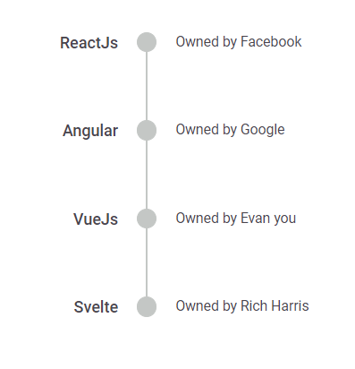
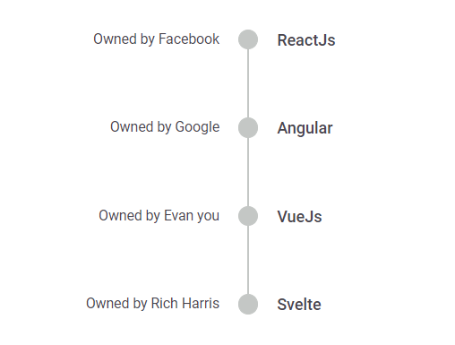
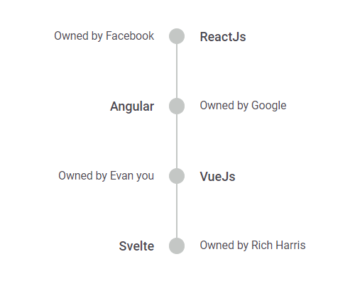

# Alignment in ##Platform_Name## Timeline control

You can display the Timeline content `Before`, `After`, `Alternate` and `AlternateReverse` by using the [align](https://help.syncfusion.com/cr/aspnetcore-js2/Syncfusion.EJ2.Layouts.Timeline.html#Syncfusion_EJ2_Layouts_Timeline_Align) property. The oppositeContent will be displayed parallel to the content when configured in the `TimelineItemModel`.

## Before

In `Before` alignment, for `horizontal` orientation the item content is placed at the top and oppositeContent at the bottom whereas in `vertical`, the content to the left and oppositeContent to the right.
























## After

In `After` alignment, for `horizontal` orientation the item content is placed at the bottom and oppositeContent at the top whereas in `vertical`, the content to the right and oppositeContent to the left.
























## Alternate

In `Alternate` alignment, the item content are arranged alternatively regardless of the Timeline orientation.
























## Alternate reverse

In `AlternateReverse` alignment, the item content are arranged in reverse alternate regardless of the Timeline orientation.
























