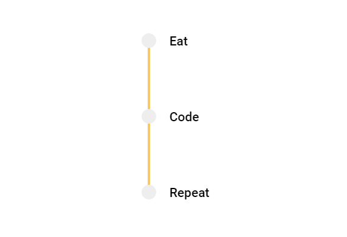
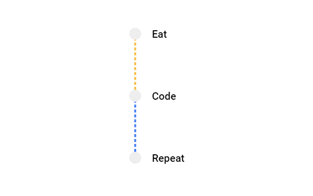
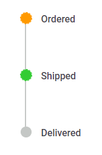
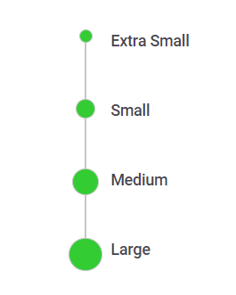
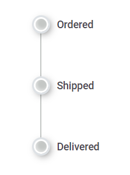
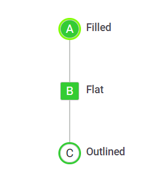
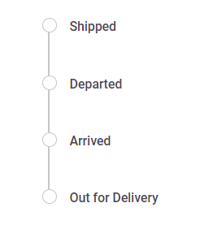

# Customization in ##Platform_Name## Timeline control

You can customize the Timeline items dot size, connectors, dot borders, dot outer space and more to personalize its appearance. This section explains the different ways for styling the items.

## Connector styling

### Common styling

You can define the styles applicable to the all the Timeline item connectors.





















### Individual styling

You can also apply unique styles to individual connectors, to differentiate specific items within the Timeline.





















## Dot styling

### Dot color

You can modify the color of the dots to highlight the specific Timeline items.





















### Dot size

You can adjust the size of the dot to make it larger or smaller by using the `--dot-size` variable.





















### Dot shadow

You can add shadow effects to the Timeline dots to make it feel visually engaging by using the `--dot-outer-space` & `--dot-border` variables.





















### Dot variant

You can achieve the desired dot variant by customizing the border, outline and background colors of the Timeline dots.





















### Dot outline

By adding the `e-outline` class to the Timeline [cssClass](https://help.syncfusion.com/cr/aspnetcore-js2/Syncfusion.EJ2.Layouts.TimelineItem.html#Syncfusion_EJ2_Layouts_TimelineItem_CssClass) property it enables the dots to have an outline state.





















