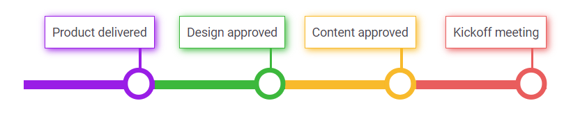

# Template in ##Platform_Name## Timeline control

The Timeline control allows you to customize the appearance for each item by using the `template` to modify the dot items, templated contents, progress bar styling and more.

The `template` context receives the following information:

| Type | Purpose |
| --- | --- |
| `item` | Indicates the current data of the Timeline item. |
| `currentItem` | Indicates the current index of the Timeline item. |
























