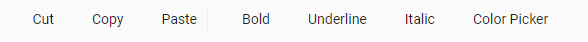
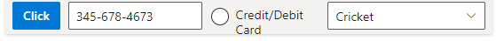

# Getting Started

 This section briefly explains about how to include a simple Toolbar in your ASP.NET MVC application. You can refer [ASP.NET MVC Getting Started documentation](../getting-started) page for introduction part part of the system requirements and configure the common specifications.

## Adding component to the Application

* Now open your view and controller page to render Toolbar component.
























Output be like the below.

## Render the Toolbar items using content template

You can bind any HTML elements or other components in Toolbar items, by simply using the content template property in ASP.NET Toolbar.

In the below demo, the Toolbar items are given as [Button](../button), [MaskedTextBox](../maskedtextbox), [RadioButton](../radio-button), [DropDownList](../drop-down-list) using the content template. In the content template property of Toolbar, you can directly render these controls like below in the code.
























Output be like the below.

## See Also

* [How to add Toggle Button](./how-to/add-toggle-button)