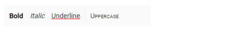
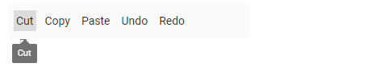

# How To

## Set command customization

The `htmlAttributes` property of the Toolbar item is used to set the HTML attributes ('ID', 'class', 'style' ,'role') for the commands.

When style attributes are added, if the same attributes were already present, they will be replaced. This is not so in the case of `class` attribute. Classes will be added to the element instead of replacing the existing ones.

Single or multiple CSS classes can be added to the Toolbar commands using the Toolbar item `cssClass` property.

























Output be like the below.



## Set Essential JS 2 Tooltip to the commands

The `tooltipText` property of the Toolbar item is used to set the HTML Tooltip to the commands that can be viewed as hint texts on mouse hover.

To change the `tooltipText` to ej2-tooltip component:

* Import the `Tooltip` module from `ej2-popups`,and initialize the Tooltip with the Toolbar target. Refer to the following code example:

























Output be like the below.



## Set item-wise custom template

The Toolbar supports adding template commands using the  `template` property. Template property can be given as the `HTML element` that is either a `string`  or a `query selector`.

### As a string

The HTML element tag can be given as a string for the template property. Here, the checkbox is rendered as a HTML template.

```typescript
template: "<div><input type='checkbox' id='check1' checked=''>Accept</input></div>"

```

### As a selector

The template property also allows getting template content through query `selector`. Here, checkbox 'ID' attribute is specified in the template.

```typescript
template: "#Template"

```

























## Add Toggle Button

Toolbar supports to add a toggle Button by using the template property. Refer below steps

* By using Toolbar template property, pass required HTML String to render toggle button.

```typescript
    template='<button class="e-btn" id="media_btn"></button>'
```

* Now render the toggle Button into the targeted element in Toolbar created event handler and bind click event for it.
On clicking the toggle Button, change the required icon and content based on current active state.

























## How to customize toolbar scrollStep

Toolbar supports to customize the scrolling distance when you click the left and right side navigation icons. Through `beforeCreate` event we can customize `scrollStep` property for scrolling distance. Please Refer below steps

* By using Toolbar scrollStep property, pass a required value to customize toolbar scrollStep.

```typescript
    function beforeCreate(e) {
        e.scrollStep = 50;
    }
```

* Now customize the scrollStep value in Toolbar beforeCreate event handler.
























