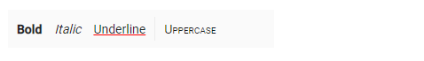

# How To Set Command Customization In ##Platform_Name## Toolbar

The `htmlAttributes` property of the Toolbar item is used to set HTML attributes ('ID', 'class', 'style', 'role') for commands.

When style attributes are added and the same attributes already exist, they will be replaced. However, the `class` attribute behaves differently. Classes are appended rather than replaced.

Single or multiple CSS classes can be added to the Toolbar commands using the Toolbar item `cssClass` property.
























The output looks like the following.

