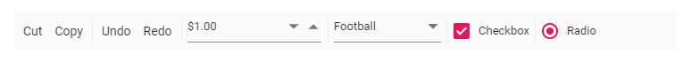

  text       | The text to be displayed for button.
 id         | The ID of the button to be rendered. If the ID is not given, auto ID is generated.
  prefixIcon | Defines the class used to specify an icon for the button. The icon is `positioned before` the text if text is available or the icon alone button is rendered.
suffixIcon | Defines the class used to specify an icon for the button. The icon is `positioned after` the text if text is available. If both `prefixIcon` and `suffixIcon` are specified, only `prefixIcon` is considered.
  width      | Used to set the width of the button.

## Separator

The `Separator` type adds a vertical separation between the Toolbar's single/multiple commands.

























> If `Separator` is added as the first or the last item, it will not be visible.

## Input

The `Input` type is only applicable for adding `template` elements when the  `template` property is defined as an `object`. Input type creates an `input element` internally that acts as the container for `Syncfusion` input based components.

### NumericTextBox

* The `NumericTextBox` component can be included by importing the `NumericTextBox` module from `ej2-inputs`.

* Initialize the `NumericTextBox` in template property, where the Toolbar item type is set as `Input`.

* Related `NumericTextBox` component properties can also be configured as given below.

```javascript

<ejs-numerictextbox format="n2"></ejs-numerictextbox>

```

### DropDownList

* The `DropDownList` component can be included by importing the `DropDownList` module from `ej2-dropdowns`.

* Initialize the `DropDownList` in template property, where the Toolbar item type is set as `Input`.

* Related `DropDownList` component properties can also be configured as given below.

```javascript

<ejs-dropdownlist width="100"></ejs-dropdownlist>

```

### RadioButton

* The `RadioButton` component can be included by importing the `RadioButton` module from `ej2-buttons`.

* Initialize the `RadioButton` in template property, where the Toolbar item type is set as `Input`.

* Related `RadioButton` component properties can also be configured as given below.

```javascript

<ejs-radiobutton label="Option 1" name="default"></ejs-radiobutton>

```

Output be like the below.



## See Also

* [How to set item wise custom template](./how-to/set-item-wise-custom-template)