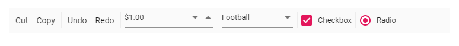

# Item Configuration in ##Platform_Name## Toolbar

The Toolbar can be rendered by defining an array of items. Items can be constructed with the following built-in command types or item template.

## Button

`Button` is the default command `type`, and it can be rendered by using the `text` property. Properties of the button command type:

|Property|Description|
|--------|-----------|
| text | The text to be displayed for button.|
| id | The ID of the button to be rendered. If the ID is not given, auto ID is generated. |
| prefixIcon | Defines the class used to specify an icon for the button. The icon is `positioned before` the text if text is available or the icon alone button is rendered. |
| suffixIcon | Defines the class used to specify an icon for the button. The icon is `positioned after` the text if text is available. If both `prefixIcon` and `suffixIcon` are specified, only `prefixIcon` is considered. |
| width | Used to set the width of the button. The value can be specified in px, %, em, or rem units. |

## Separator

The `Separator` type adds a vertical separation between the Toolbar's single/multiple commands.
























N> If `Separator` is added as the first or the last item, it will not be visible.

## Input

The `Input` type is only applicable for adding `template` elements when the `template` property is defined as an `object`. The Input type creates an `<input>` element internally that acts as the container for Syncfusion input-based components.

>Note: Set toolbar item **type** property value as `Input` only for Input components.

### NumericTextBox

* The `NumericTextBox` component can be included by importing the `NumericTextBox` module from `ej2-inputs`.

* Initialize the `NumericTextBox` in the template property, where the Toolbar item type is set as `Input`.

* Related `NumericTextBox` component properties can also be configured as shown below.

```javascript

<ejs-numerictextbox format="n2"></ejs-numerictextbox>

```

### DropDownList

* The `DropDownList` component can be included by importing the `DropDownList` module from `ej2-dropdowns`.

* Initialize the `DropDownList` in the template property, where the Toolbar item type is set as `Input`.

* Related `DropDownList` component properties can also be configured as shown below.

```javascript

<ejs-dropdownlist width="100"></ejs-dropdownlist>

```

### RadioButton

* The `RadioButton` component can be included by importing the `RadioButton` module from `ej2-buttons`.

* Initialize the `RadioButton` in the template property, where the Toolbar item type is set as `Input`.

* Related `RadioButton` component properties can also be configured as shown below.

```javascript

<ejs-radiobutton label="Option 1" name="default"></ejs-radiobutton>

```

The output will look like the following:



### Enabling Tab key navigation in Toolbar

The `tabIndex` property of a Toolbar item is used to enable Tab key navigation for the item. By default, the user can switch between items using the arrow keys. The `tabIndex` property allows you to also switch between items using the Tab and Shift+Tab keys.

To use the `tabIndex` property, you need to set it for each Toolbar item that you want to enable tab key navigation. The `tabIndex` property should be set to a positive integer value. A value of 0 or a negative value will disable tab key navigation for the item.

Here is an example of how to enable Tab key navigation for Toolbar items using positive `tabIndex` values:

```javascript
@using Syncfusion.EJ2.Navigations;

<ejs-toolbar id="defaultToolbar">
    <e-toolbar-items>
        <e-toolbar-item text="Item 1" tabIndex="1"></e-toolbar-item>
        <e-toolbar-item text="Item 2" tabIndex="2"></e-toolbar-item>       
    </e-toolbar-items>
</ejs-toolbar>
```

With the above code, the user can switch between the two Toolbar items using the Tab and Shift+Tab keys, in addition to using the arrow keys. The items will be navigated in the order specified by the `tabIndex` values.

Alternatively, if you set the `tabIndex` value to 0 for all Toolbar items, tab key navigation will be based on the element order in the DOM:

```javascript
@using Syncfusion.EJ2.Navigations;

<ejs-toolbar id="defaultToolbar">
    <e-toolbar-items>
        <e-toolbar-item text="Item 1" tabIndex="0"></e-toolbar-item>
        <e-toolbar-item text="Item 2" tabIndex="0"></e-toolbar-item>       
    </e-toolbar-items>
</ejs-toolbar>
```

In this case, the user can switch between the two Toolbar items using the Tab and Shift+Tab keys, and the items will be navigated in the order in which they appear in the DOM.

Example:

Here is an example of how you can use the `tabIndex` property to enable tab key navigation for a Toolbar component:
























With the above code, the user can switch between the Toolbar items using the Tab and Shift+Tab keys, and the items will be navigated based on the element order.

## See Also

* [How to set item wise custom template](./how-to/set-item-wise-custom-template)