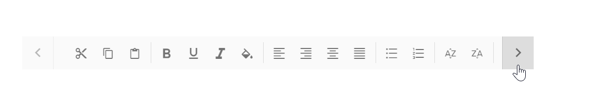
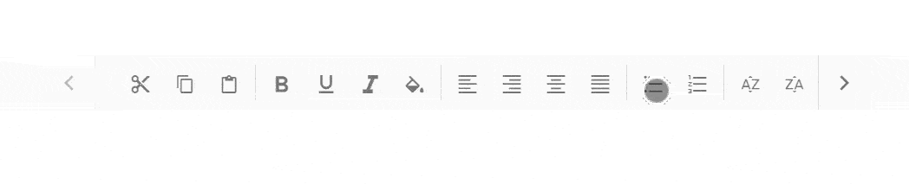
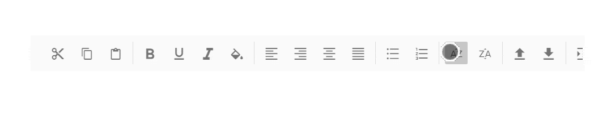
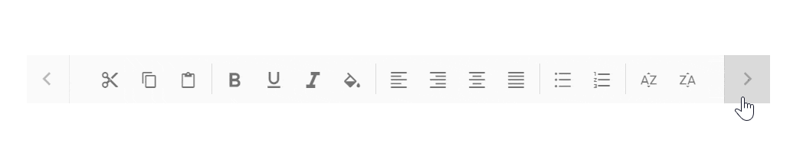
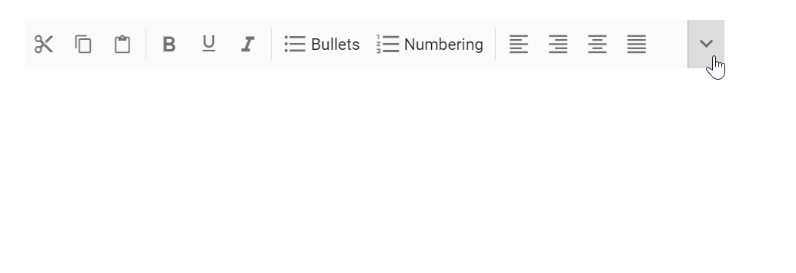

# Responsive Mode

This section explains the supported display modes of the Toolbar when the content exceeds the viewing area. Possible modes are:

* Scrollable
* Popup

## Scrollable

The default overflow mode of the Toolbar is `Scrollable`. Scrollable display mode supports display of commands in a single line with horizontal scrolling enabled when commands overflow to available space.

* The right and left navigation arrows are added to the start and end of the Toolbar to navigate to hidden commands.
* You can also see the hidden commands using touch swipe action.
* By default, if navigation icon in the `left` side is disabled, you can see the hidden commands by moving to the `right`.
* By clicking the arrow or by holding the arrow continuously,  hidden commands will become visible.
* If device navigation icons are not available, you can touch swipe to see the hidden commands of the Toolbar.

* Once the Toolbar reaches the last or first command, the  corresponding navigation icon will be disabled and you can move to the opposite direction.

* You can continuously scroll the Toolbar content by holding the navigation icon.
























## Popup

`Popup` is another type of `overflowMode` in which the Toolbar container holds the commands that can be placed in the available space. The rest of the overflowing commands that do not fit within
the viewing area moves to the overflow popup container.

The commands placed in the popup can be viewed by opening the popup using the drop down icon given at the end of the Toolbar.

> If the popup content overflows the height of the page, then the rest of the commands will be hidden.

### Priority of commands

Default popup priority is set as `none`, and when the commands of the Toolbar overflow, the ones listed last will be moved to the popup.

You can customize the priority of commands to be displayed on the Toolbar and popup by using the `Overflow` property.

Property     | Description
------------ | -------------
  show       | Always shows items on the `Toolbar with primary` priority.
  hide       | Always shows items in the `popup with secondary` priority.
  none       | No priority display, and as per the `normal order` commands are moved to popup when content exceeds viewing area.

If primary priority commands also exceed available space, they are moved to the popup container at top order position and placed before the secondary priority commands.

> You can maintain toolbar item on popup always by using the [ShowAlwaysInPopup](https://help.syncfusion.com/cr/aspnetmvc-js2/Syncfusion.EJ2~Syncfusion.EJ2.Navigations.ToolbarItem~ShowAlwaysInPopup.html) property, and this behavior is not applicable for toolbar items with [Overflow](https://help.syncfusion.com/cr/aspnetmvc-js2/Syncfusion.EJ2~Syncfusion.EJ2.Navigations.ToolbarItem~Overflow.html) property as 'show'.
























### Text mode for buttons

The `ShowTextOn` property is used to decide button text display area on the Toolbar, popup, or both. This is useful for customization of both text and image representation of commands.

For example, you can show icon only button on the Toolbar, and in the popup container display more information about the commands with icon and text.

Possible values are,

  Property   | Description
------------ | -------------
  Both     | Button text is visible in both `Toolbar` and `Popup`.
  Overflow | Button text is only visible in `Popup`.
  Toolbar  | Button text is only visible on the `Toolbar`.

In the following code sample, text is only visible in the popup container and not in the Toolbar container.
























