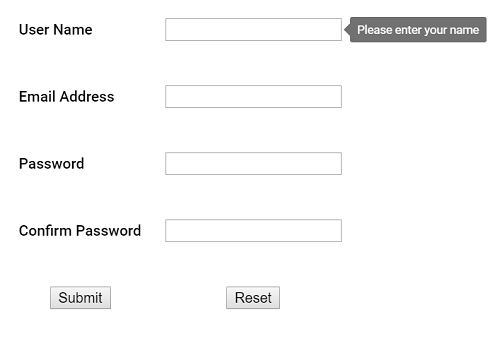

# Accessibility

The Tooltip component has been designed, keeping in mind the [WAI-ARIA](http://www.w3.org/WAI/PF/aria-practices/) specifications, and
 applies the WAI-ARIA roles, states, and properties along with keyboard support. This makes it easy for people who use assistive
  technologies (AT) or who completely rely on keyboard navigation. As per the accessibility standard, the Tooltip opens on target elements
   to which it is attached as and when those target elements receive either keyboard focus or when the mouse hovers
    over it. When `esc` key is pressed, the Tooltip closes.

The Tooltip is made available to screen readers using the `aria-describedby` property. To be accurate, it must be used with an ARIA compliant browser along with the screen reader running from backend.

## ARIA attributes

Tooltip element is assigned with the role of `Tooltip`.

| Attributes | Description |
| --- | --- |
| role="tooltip" | This attribute  added to the Tooltip element describes the actual role of the element. |
| aria-describedby | This attribute is added to the target element on which the Tooltip gets opened, when focusing or hovering over it. It usually holds the randomly generated `Id` value of the Tooltip element.    In case, the target element already holds an `aria-describedby` attribute with `Id` value of some other component, then the Tooltip Id value can be additionally appended to the existing `aria-describedby` attribute separated by a space as shown in the example below.   **For example:**   aria-describedby = "my-text my-tooltip"   **my-text** is the Id of some other component.  **my-tooltip** is the id of Tooltip component.    When the Tooltip is closed, the `aria-describedby` attribute is  removed from the target. |
| aria-hidden | This attribute is assigned to the Tooltip element whose default value is true.    When `true`, it denotes that the Tooltip element is in a hidden or a closed state. When the Tooltip appears on the screen, it’s value changes to `false`.|

## Keyboard interaction

The following are the standard keys that work on Tooltip.

|  Keys | Description |
| --- | --- |
| Tab | A form control receiving focus (say through tab key), opens the Tooltip, and on focus out closes it. |
| Escape | Closes or dismisses the Tooltip. |

> 1. When the Tooltip is being displayed on the target element, focus continues to stay on it.
> 2. If the Tooltip opens on mouse entering into the target element space, then it should be dismissed only when the mouse leaves that target.
> 3. If the Tooltip opens on the target element that receives focus, then it should be closed only when the focus moves out of that target element.
 Likewise, if the Tooltip opens on a click, then it should be closed only on another click action.

In the following preview sample, focusing the input element through `tab` key opens the Tooltip and  pressing the `esc` key closes it.
























Output be like the below.

