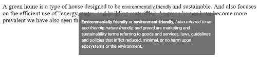

# Content

A text or a piece of information assigned to the Tooltip's `content` property will be displayed as the main text stream of the Tooltip.
 It can be a string or a template content. If the `content` property is not provided with any specific value, then it takes the value
  assigned to the `title` attribute of the target element on which the Tooltip was initialized. The content can also dynamically be
   assigned to the Tooltip via AJAX.

## Template content

Any text or image can be added to the Tooltip, by default. To customize the Tooltip layout or to create your own visualized element on the
 Tooltip, template can be used.

Refer to the following code example to add formatted HTML content to the Tooltip.





Output be like the below.

## Dynamic content via AJAX

The Tooltip content can be dynamically loaded  by making use of the AJAX call. The AJAX request is usually made within the `beforeRender`
 event of the Tooltip, and then the Tooltip's `content` is assigned the value retrieved on it's success.





Output be like the below.

