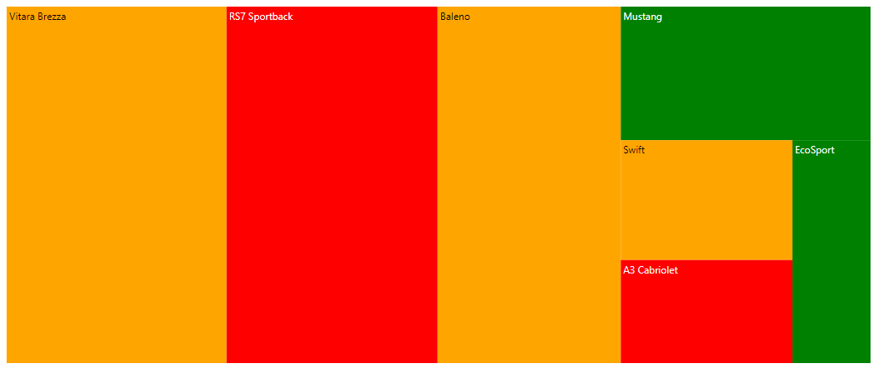
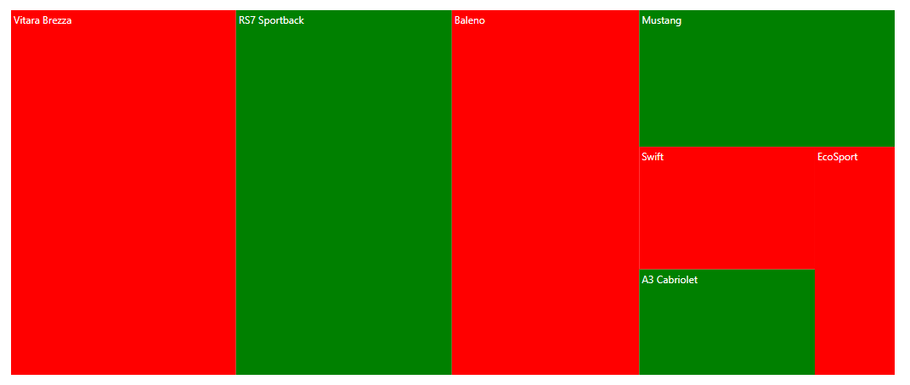
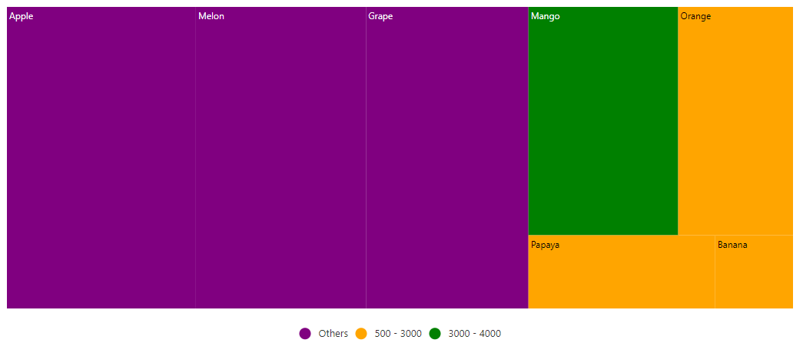

# Color Mapping

Color mapping is used to customize the color for each group or item based on the specified types. The following options are available to customize the group and leaf items in the TreeMap.

## Range color mapping

Range color mapping is used to apply color to the items by giving specific ranges in the DataSource, and it should be specifying the data source properties to the `rangeColorValuePath`. The color mapping ranges to be specified in the `from` and `to` properties of the `colorMapping`.
























## Equal color mapping

Equal color mapping is used to fill colors to each item by specifying equal value present in the data source, that can be specified in the `equalColorValuePath` property.
























## Desaturation color mapping

Desaturation color mapping is used to apply colors to the items based on `minOpacity` and `maxOpacity` properties in the `colorMapping`.
























## Palette color mapping

The palette color mapping is used to fill the color to each group or leaf item by given colors in the `palette` property.
























## Desaturation with multiple colors

Multiple colors are used as gradient effect to specific shapes based on the ranges in datasource. By using [`color`] property, you can set n number of colors.
























## Color for items excluded from color mapping

Get the excluded ranges from data source using the color mapping and apply the specific color to those items, without specifying the `from` and `to` properties.
























## Bind the colors to the items from data source

To set the color for each item from the data source, bind the data source property to the `colorValuePath`.
























