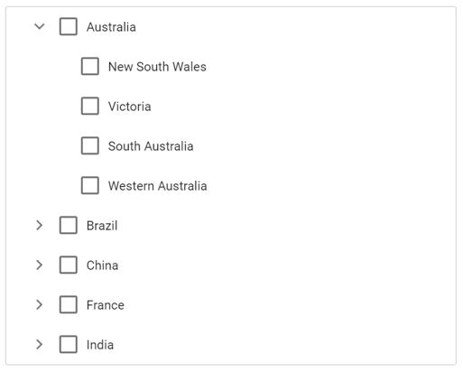

# CheckBox in ##Platform_Name## TreeView

The [TreeView](https://www.syncfusion.com/aspnet-core-ui-controls/treeview) control allows you to check more than one node in the TreeView without affecting the UI's appearance by enabling the [showCheckBox](https://help.syncfusion.com/cr/aspnetcore-js2/Syncfusion.EJ2.Navigations.TreeView.html#Syncfusion_EJ2_Navigations_TreeView_ShowCheckBox) property. When this property is enabled, a checkbox appears before each TreeView node text.

* If one of the child nodes is unchecked, then the parent node will be in an intermediate state.

* If all the child nodes are in a checked state, then the parent node's state will also be checked.

* If a parent node is checked, then all child nodes will also be checked.

By default, the checkbox state of parent and child nodes are dependent on each other. If you need independent checked states, you can achieve this using the [autoCheck](https://help.syncfusion.com/cr/aspnetcore-js2/Syncfusion.EJ2.Navigations.TreeView.html#Syncfusion_EJ2_Navigations_TreeView_AutoCheck) property.

Using the [checkedNodes](https://help.syncfusion.com/cr/aspnetcore-js2/Syncfusion.EJ2.Navigations.TreeView.html#Syncfusion_EJ2_Navigations_TreeView_CheckedNodes) property, you can set the nodes that need to be checked or get the ID of nodes that are currently checked in the TreeView control.

If you need to prevent the node check action for a particular node, the [nodeChecking](https://help.syncfusion.com/cr/aspnetcore-js2/Syncfusion.EJ2.Navigations.TreeView.html#Syncfusion_EJ2_Navigations_TreeView_NodeChecking) event can be used which is triggered before the TreeView node is checked/unchecked. The [nodeChecked](https://help.syncfusion.com/cr/aspnetcore-js2/Syncfusion.EJ2.Navigations.TreeView.html#Syncfusion_EJ2_Navigations_TreeView_NodeChecked) event will be triggered when the TreeView node is successfully checked or unchecked.

In the following example, the `showCheckBox` property is enabled.
























The output will look like the image below:

## Checked nodes

You can get or set the checked nodes in the TreeView at initial rendering and dynamically by using the [checkedNodes](https://help.syncfusion.com/cr/aspnetcore-js2/Syncfusion.EJ2.Navigations.TreeView.html#Syncfusion_EJ2_Navigations_TreeView_CheckedNodes) property. It returns the IDs of the checked nodes as an array.

In the following example, the **New South Wales** and **Western Australia** nodes are checked at initial rendering. If any additional nodes are checked, the IDs of all checked nodes will be displayed in an alert.
























## See also

* [How to check/uncheck the checkbox on clicking the tree node text](./how-to/check-uncheck-the-checkbox-on-clicking-the-tree-node-text)
