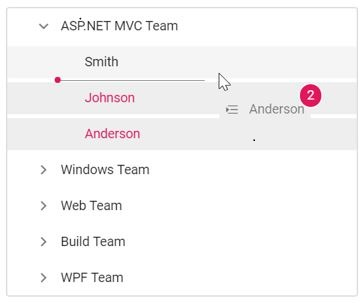

# Drag and Drop

The TreeView control allows you to drag and drop any node by setting [allowDragAndDrop](https://help.syncfusion.com/cr/aspnetcore-js2/Syncfusion.EJ2~Syncfusion.EJ2.Navigations.TreeView~AllowDragAndDrop.html)&nbsp;to **true**. Nodes can be dragged and dropped at all levels of the same TreeView.

The dragged nodes can be dropped at any level by indicator lines with **line**, **plus/minus**, and **restrict** icons. It represents the exact position where the node is to be dropped as sibling or child.

The following table explains the usage of indicator icons.

| Icons | Description |
|------|-------------|
| Plus icon | Indicates that the dragged node is to be added as child of target node. |
| Minus or restrict icon |Indicates that the dragged node is not to be dropped at the hovered region. |
| In between icon | Indicates that the dragged node is to be added as siblings of hovered region. |

* If you need to prevent dragging action for a particular node, the [`nodeDragStart`](https://help.syncfusion.com/cr/aspnetcore-js2/Syncfusion.EJ2~Syncfusion.EJ2.Navigations.TreeView~NodeDragStart.html) event can be used which is triggered when the node drag is started. If you need to prevent dropping action for a particular node, the [`nodeDragStop`](https://help.syncfusion.com/cr/aspnetcore-js2/Syncfusion.EJ2.Navigations.TreeView.html#Syncfusion_EJ2_Navigations_TreeView_NodeDragStop) event can be used which is triggered when the drag is stopped.

* The [`nodeDragging`](https://help.syncfusion.com/cr/aspnetcore-js2/Syncfusion.EJ2~Syncfusion.EJ2.Navigations.TreeView~NodeDragging.html) event is triggered when the TreeView node is being dragged. You can customize the cloned element in this event.

* The [`nodeDropped`](https://help.syncfusion.com/cr/aspnetcore-js2/Syncfusion.EJ2~Syncfusion.EJ2.Navigations.TreeView~NodeDropped.html) event is triggered when the TreeView node is dropped on the target element successfully.

In the following sample, the [allowDragAndDrop](https://help.syncfusion.com/cr/aspnetcore-js2/Syncfusion.EJ2~Syncfusion.EJ2.Navigations.TreeView~AllowDragAndDrop.html) property is enabled.
























Output be like the below.

## Multiple-node drag and drop

To drag and drop more than one node, you should enable the [allowMultiSelection](https://help.syncfusion.com/cr/aspnetcore-js2/Syncfusion.EJ2~Syncfusion.EJ2.Navigations.TreeView~AllowMultiSelection.html) property along with the `allowDragAndDrop` property.

To perform multi-selection, press and hold **CTRL** key and click the desired nodes. To select range of nodes, press and hold the **SHIFT** key and click the nodes.

In the following sample,  the `allowMultiSelection` property is  enabled along with the `allowDragAndDrop` property.
























Output be like the below.

## See Also

* [How to restrict the drag-and-drop for particular tree nodes](./how-to/restrict-the-drag-and-drop-for-particular-tree-nodes)