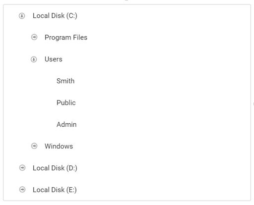

# Customize the expand and collapse icons

You can customize TreeView expand and collapse icons by using the [`cssClass`](https://help.syncfusion.com/cr/aspnetcore-js2/Syncfusion.EJ2~Syncfusion.EJ2.Navigations.TreeView~CssClass.html)&nbsp;property of TreeView.
Refer to the sample to customize expand/collapse icons.
























Output be like the below.

