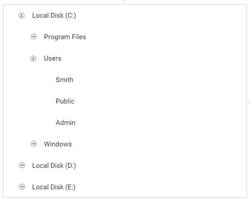

# How to customize the expand and collapse icons in ##Platform_Name## TreeView

You can customize the TreeView's expand and collapse icons by using the `cssClass` property of TreeView. Refer to the following sample to see how to customize expand/collapse icons.
























The output will look like the image below:

