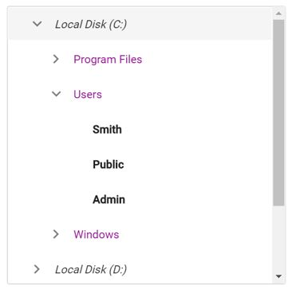

# How to customize the TreeView nodes based on levels in ##Platform_Name## TreeView

You can customize the tree nodes based on their levels by adding a custom `cssClass` to the control and enabling specific styles.
























The output will look like the image below:

