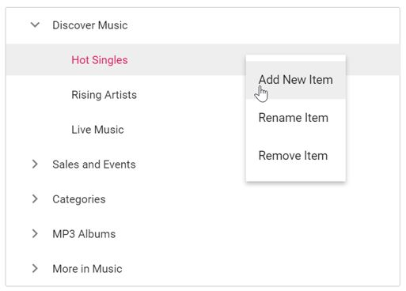

# How to perform TreeView node operations using Context Menu in ##Platform_Name## TreeView

You can integrate the Context Menu with '**TreeView**' control to perform TreeView-related operations such as adding, removing, and renaming nodes.

The following example demonstrates how to manipulate TreeView operations using the **select** event of the Context Menu.
























The output will look like the image below:

