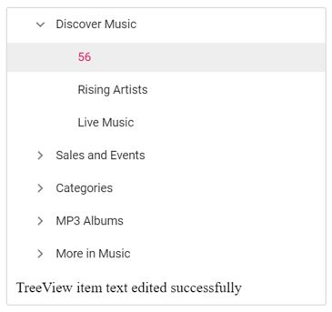

# How to validate text when renaming the TreeView node in ##Platform_Name## TreeView

You can validate the tree node text during editing by using the `nodeEdited` event of the TreeView. The following example shows how to validate and prevent empty values in a tree node.
























The output will look like the image below:

