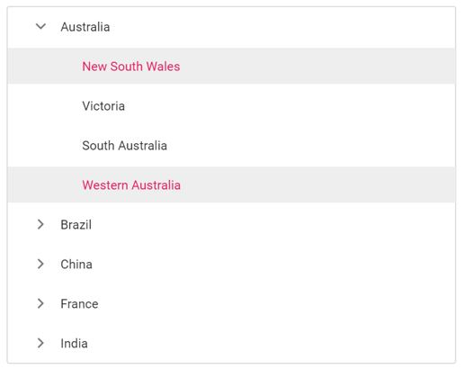

# Multi Selection

Selection provides an interactive support and highlights the node that you select. Selection can be done through simple mouse down or keyboard interaction.

The TreeView also supports selection of multiple nodes by setting [allowMultiSelection](https://help.syncfusion.com/cr/aspnetcore-js2/Syncfusion.EJ2~Syncfusion.EJ2.Navigations.TreeView~AllowMultiSelection.html) to **true**.

To multi-select, press and hold **CTRL** key and click the desired nodes. To select range of nodes, press and hold the **SHIFT** key and click the nodes.
In the following example, the `allowMultiSelection` property is enabled.

> Multi selection is not applicable through touch interactions.
























Output be like the below.

## Selected nodes

You can get or set the selected nodes in TreeView at initial rendering and dynamically by using the [selectedNodes](https://help.syncfusion.com/cr/aspnetcore-js2/Syncfusion.EJ2~Syncfusion.EJ2.Navigations.TreeView~SelectedNodes.html) property. It will return the selected node’s ID as an array.

* The [`nodeselecting`](https://help.syncfusion.com/cr/aspnetcore-js2/Syncfusion.EJ2~Syncfusion.EJ2.Navigations.TreeView~NodeSelecting.html) event is triggered before a node is selected/unselected which can be used to prevent the selection.

* The [`nodeSelected`](https://help.syncfusion.com/cr/aspnetcore-js2/Syncfusion.EJ2~Syncfusion.EJ2.Navigations.TreeView~NodeSelected.html) event is triggered once a node is successfully selected/unselected.

In the following example, **New South Wales** and **Western Australia** nodes are selected at initial rendering. When a node is selected, the selected node’s ID is displayed in alert.
























