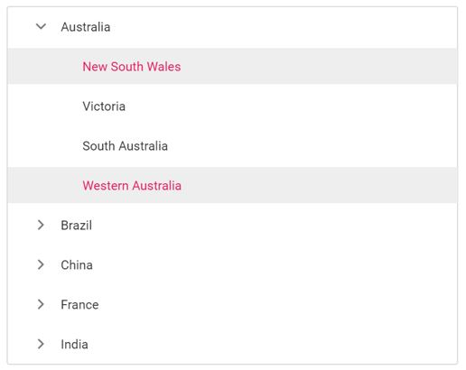

# Multiple Selection in ##Platform_Name## TreeView

Selection provides interactive support and highlights the node that you select. Selection can be performed using mouse or keyboard interactions. 

The [TreeView](https://www.syncfusion.com/aspnet-core-ui-controls/treeview) control supports selection of multiple nodes by setting the [allowMultiSelection](https://help.syncfusion.com/cr/aspnetcore-js2/Syncfusion.EJ2.Navigations.TreeView.html#Syncfusion_EJ2_Navigations_TreeView_AllowMultiSelection) property to **true**. 

To multi-select, press and hold the **CTRL** key and click the desired nodes. To select a range of nodes, press and hold the **SHIFT** key and click the nodes. In the following example, the `allowMultiSelection` property is enabled.

N> Multi selection is not applicable through touch interactions.
























The output will look like the image below:

## Selected nodes

You can get or set the selected nodes in the TreeView at initial rendering and dynamically by using the [selectedNodes](https://help.syncfusion.com/cr/aspnetcore-js2/Syncfusion.EJ2.Navigations.TreeView.html#Syncfusion_EJ2_Navigations_TreeView_SelectedNodes) property. It will return the IDs of the selected nodes as an array.

* The [nodeselecting](https://help.syncfusion.com/cr/aspnetcore-js2/Syncfusion.EJ2.Navigations.TreeView.html#Syncfusion_EJ2_Navigations_TreeView_NodeSelecting) event is triggered before a node is selected/unselected which can be used to prevent the selection.

* The [nodeSelected](https://help.syncfusion.com/cr/aspnetcore-js2/Syncfusion.EJ2.Navigations.TreeView.html#Syncfusion_EJ2_Navigations_TreeView_NodeSelected) event is triggered once a node is successfully selected/unselected.

In the following example, **New South Wales** and **Western Australia** nodes are selected at initial rendering. When a node is selected, the selected node’s ID is displayed in an alert.






















