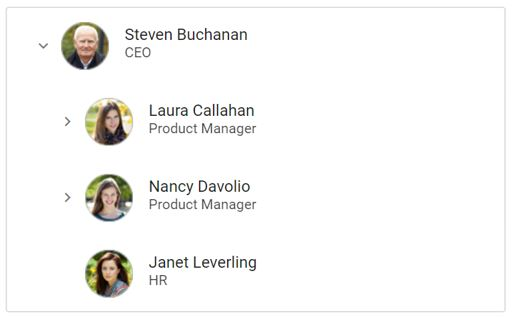

# Template in ##Platform_Name## TreeView

The [TreeView](https://www.syncfusion.com/aspnet-core-ui-controls/treeview) control allows you to customize the look of the TreeView nodes by using the [nodeTemplate](https://help.syncfusion.com/cr/aspnetcore-js2/Syncfusion.EJ2.Navigations.TreeView.html#Syncfusion_EJ2_Navigations_TreeView_NodeTemplate) property. This property accepts either a `template string` or an HTML element ID.

In the following sample, employee information such as an employee photo, name, and designation has been included using the `nodeTemplate` property.

The template expression should be provided inside the `${...}` interpolation syntax.
























The output will look like the image below:

## See Also

* [How to customize the expand and collapse icons](./how-to/customize-the-expand-and-collapse-icons)
* [How to customize the tree nodes based on levels](./how-to/customize-the-tree-nodes-based-on-levels)