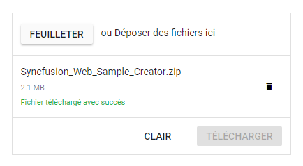

# Localization in ##Platform_Name## File Upload

The Localization library allows you to localize static text content of the [Uploader](https://www.syncfusion.com/aspnet-core-ui-controls/file-upload). The static text includes the default text of action buttons, file status, clear icon title, tooltips, and the drag area text. Define the locale object for a culture and assign it to the `L10n.load` method.

## Localization keys

The following is a list of the keys and their values used in the Uploader control:

| Keys | Description |
|------------------------|---------|
| Browse | To customize the browse button text.|
| Clear | To customize the clear button text.|
| Upload | To customize the upload button text. |
| dropFilesHint | To customize the drop area text. |
| uploadFailedMessage | To customize the status text when the file is failed to upload.|
| uploadSuccessMessage | To customize the status text when the file is uploaded successfully.|
| removedSuccessMessage | To customize the status text when the file is removed the successfully from the server.|
| removedFailedMessage | To customize the status text when the file fails to be removed.|
| inProgress | To customize the status text while the upload is in progress.|
| pauseUpload | To customize the status text while the uploading is paused.|
| fileUploadCancel | To customize the status text when uploading is canceled.|
| readyToUploadMessage | To customize the status text when the file is selected and ready to upload.|
| invalidMaxFileSize | To customize the status text when the file size is greater than the maximum file size.|
| invalidFileType | To customize the status text when the file type is invalid.|
| invalidMinFileSize | To customize the status text when the file size is less than the minimum file size. |
| remove | To customize tooltip text for remove icon. |
| cancel | To customize tooltip text for cancel icon. |
| delete | To customize tooltip text for delete icon. |
| totalFiles | To customize tooltip text for total files. |
| size | To customize tooltip text for size. |

The following example demonstrates how to localize the static text content of the Uploader control into French (`fr-CH`):
























The output will be as shown below.

