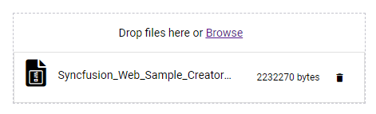
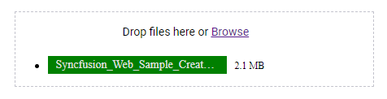

# Template

You can customize the default appearance of the uploader using a template along with buttons.

## File list template

The [template](https://help.syncfusion.com/cr/aspnetcore-js2/Syncfusion.EJ2.Inputs.Uploader.html#Syncfusion_EJ2_Inputs_Uploader_Template) property is used to customize the default appearance of each file in the list. It can be represented as the HTML element or string. The selected or dropped files are displayed as per the template layout provided. The remove and progress bar action is handled using the corresponding events when the template is defined.

For example, you can display file type icon along with the default UI elements.
























Output be like the below.

## Custom template

You can design the own template by preventing the default file list including buttons. The [showFileList](https://help.syncfusion.com/cr/aspnetcore-js2/Syncfusion.EJ2.Inputs.Uploader.html#Syncfusion_EJ2_Inputs_Uploader_ShowFileList) property is used to display whether the default file list or own file list when you use custom template to upload or remove the files, pass the custom UI argument as true to call `upload`/`remove` public method as follows:

* UploaderObj.`upload(filesData, true)`;

* UploaderObj.`remove(filesData, true)`;

Refer to the following code sample.
























Output be like the below.

## See Also

* [Customize progress bar](./how-to/customize-progressbar)
* [Customize button with HTML element](./how-to/customize-button-with-html-element)
* [Customize drop area](./how-to/hide-default-drop-area)
