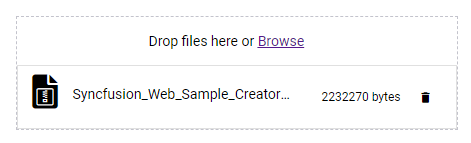
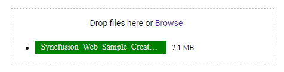

# Template in ##Platform_Name## File Upload

You can customize the default appearance of the uploader using a template along with buttons.

## File list template

The [`template`](https://help.syncfusion.com/cr/aspnetcore-js2/Syncfusion.EJ2.Inputs.Uploader.html#Syncfusion_EJ2_Inputs_Uploader_Template) property is used to customize the default appearance of each file in the list. It can be represented as an HTML element or string. The selected or dropped files are displayed as per the template layout provided. The remove and progress bar actions are handled using the corresponding events when the template is defined.

For example, you can display a file type icon along with the default UI elements.
























* The template defines the custom layout for each file in the list, including the file type icon, file name, file size, remove button, and progress bar.
* The `progress` event updates the progress bar value and percentage text during upload.
* The `success` event marks the file as uploaded successfully and adjusts the drop area height.
* The `failure` event marks the file as failed to upload.
* The `selected` event resizes the drop area based on the number of files selected.

The output will be as shown below.

## Custom template

You can design your own template by hiding the default file list, including its buttons. The [`showFileList`](https://help.syncfusion.com/cr/aspnetcore-js2/Syncfusion.EJ2.Inputs.Uploader.html#Syncfusion_EJ2_Inputs_Uploader_ShowFileList) property is used to determine whether to display the default file list or your own file list. When you use a custom template to upload or remove files, pass the custom UI argument as `true` to call the `upload`/`remove` public methods, as follows:

* UploaderObj.`upload(filesData, true)`;

* UploaderObj.`remove(filesData, true)`;

Refer to the following code sample.
























**Key points**:

* The `showFileList` property is set to false to hide the default file list and use a custom template instead.
* The `selected` event creates a custom list item (`<li>`) for each selected file, including the file name, size, progress bar, and remove icon.
* The `progress` event updates the progress bar value during upload.
* The `success` event marks the file as uploaded successfully and updates the remove icon to a delete icon.
* The `failure` event marks the file as failed to upload.
* The `removeFiles` function handles the remove action when the close icon is clicked.

The output will be as shown below.

## See also

* [Customize progress bar](./how-to/customize-progressbar)
* [Customize button with HTML element](./how-to/customize-button-with-html-element)
* [Customize drop area](./how-to/hide-default-drop-area)
