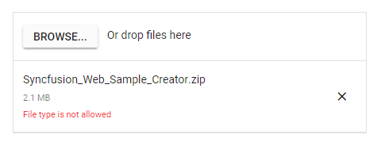
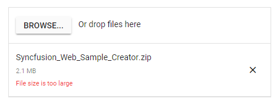

# Validation in ##Platform_Name## File Upload

The Uploader control validates the selected file's size and extension using the [`allowedExtensions`](https://help.syncfusion.com/cr/aspnetcore-js2/Syncfusion.EJ2.Inputs.Uploader.html#Syncfusion_EJ2_Inputs_Uploader_AllowedExtensions), [`minFileSize`](https://help.syncfusion.com/cr/aspnetcore-js2/Syncfusion.EJ2.Inputs.Uploader.html#Syncfusion_EJ2_Inputs_Uploader_MinFileSize) and [`maxFileSize`](https://help.syncfusion.com/cr/aspnetcore-js2/Syncfusion.EJ2.Inputs.Uploader.html#Syncfusion_EJ2_Inputs_Uploader_MaxFileSize) properties. The files can be validated before uploading to the server and ignored during upload. Additionally, you can validate the files by setting the HTML attributes on the input element. The validation process also occurs when you drag and drop the files.

## File type

You can allow only specific files to be Uploaded using the [`allowedExtensions`](https://help.syncfusion.com/cr/aspnetcore-js2/Syncfusion.EJ2.Inputs.Uploader.html#Syncfusion_EJ2_Inputs_Uploader_AllowedExtensions) property. The extension can be specified as a comma-separated list. The uploader control filters the selected or dropped files to match the specified file types and processes the upload operation. The validation also occurs when you specify a value as an inline attribute on the original input element.
























Output be like the below.

## File size

The Uploader control allows you to validate the files based on their size. The validation helps to restrict uploading large or empty files to the server. The file size is measured in `bytes`. By default, the Uploader control allows you to upload files with a **minimum file size** of 0 bytes and a **maximum file size** of 28.4 MB, using the [`minFileSize`](https://help.syncfusion.com/cr/aspnetcore-js2/Syncfusion.EJ2.Inputs.Uploader.html#Syncfusion_EJ2_Inputs_Uploader_MinFileSize) and [`maxFileSize`](https://help.syncfusion.com/cr/aspnetcore-js2/Syncfusion.EJ2.Inputs.Uploader.html#Syncfusion_EJ2_Inputs_Uploader_MaxFileSize) properties.
























The output will be as shown below.

## Maximum files count

You can restrict uploading the maximum number of files using the `selected` event. In the selected event arguments, you can get the details of currently selected files using `getFilesData()`. You can modify the files' details and assign the modified file list to `eventArgs.modifiedFilesData`.
























## Duplicate files

You can check for duplicate files before uploading them to the server using the `selected` event. Compare the selected files with the existing files data and filter the file list to remove the duplicate files.
























## See also

* [Validate image/* on drop](./how-to/validate-image-on-drop)
* [Determine whether uploader has file input (required validation)](./how-to/determine-whether-the-uploader-has-input-file)
* [Check file size before uploading it](./how-to/check-file-size-before-uploading-it)
* [Check the MIME type of file before uploading it](./how-to/check-the-mime-type-of-file-before-upload-it)
