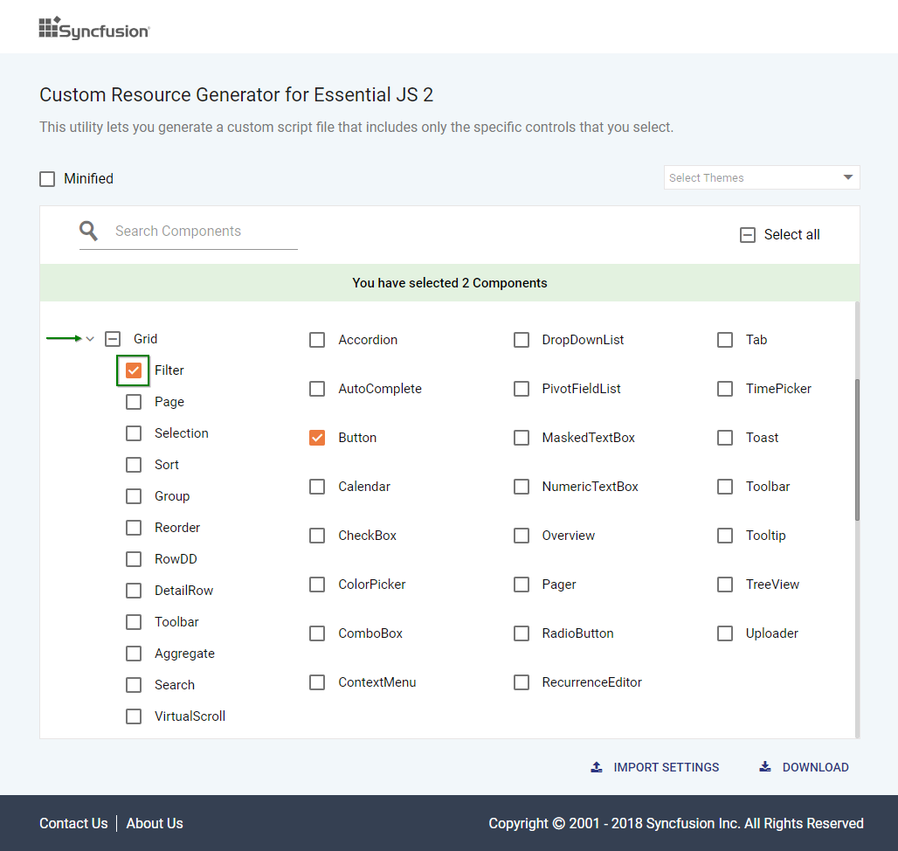
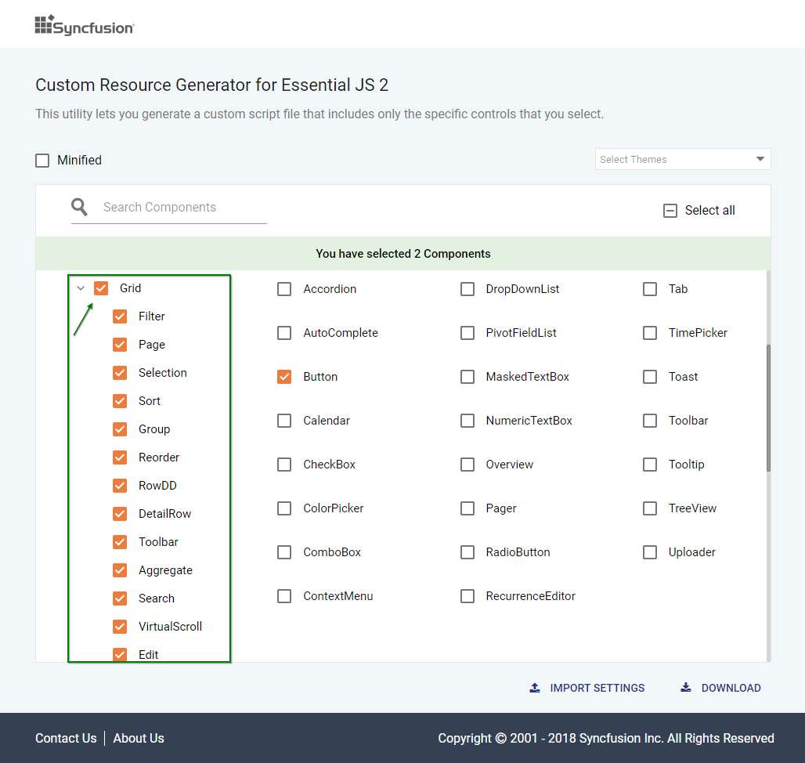
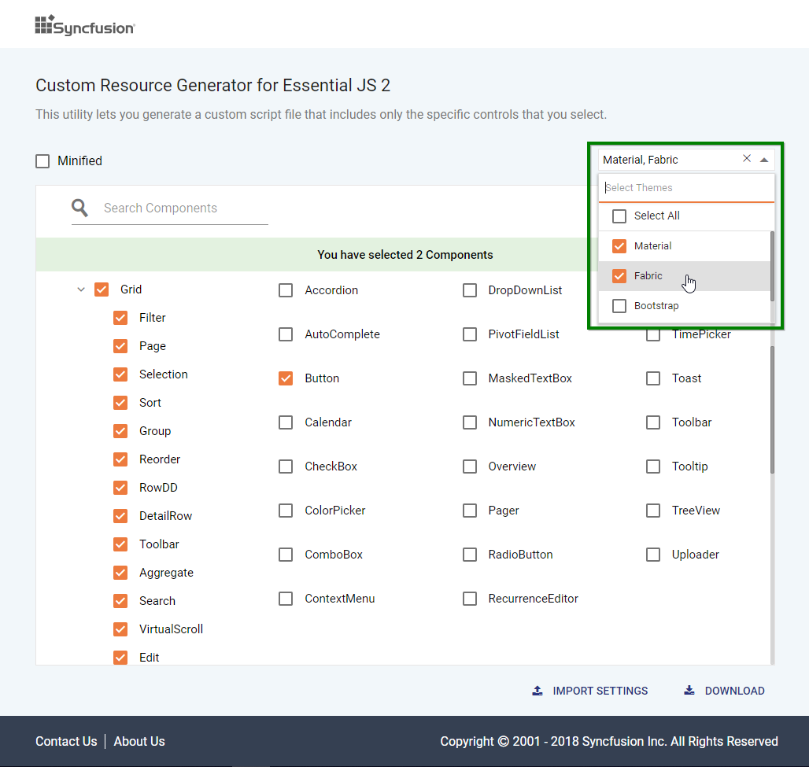
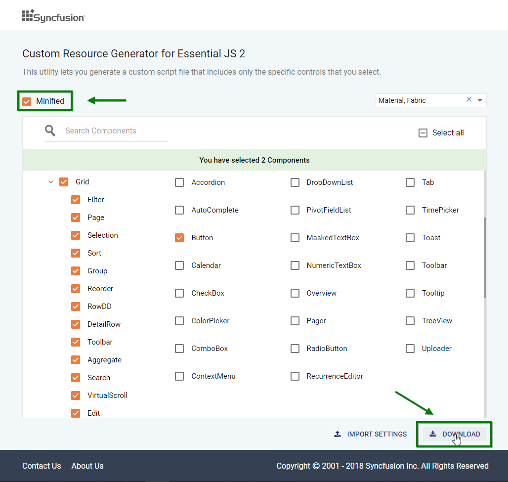
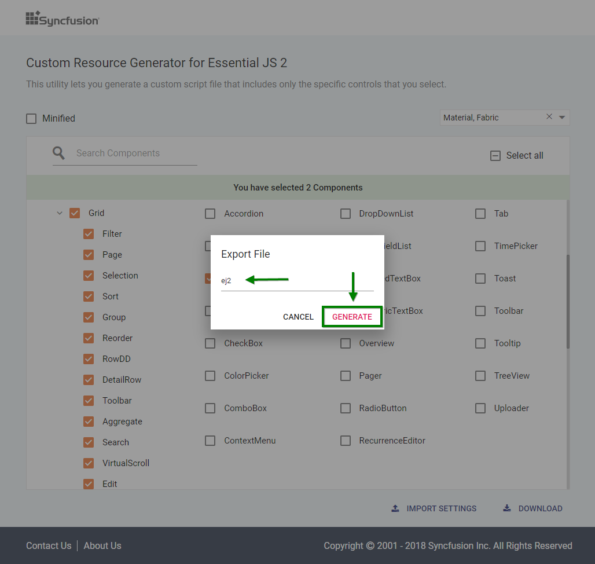
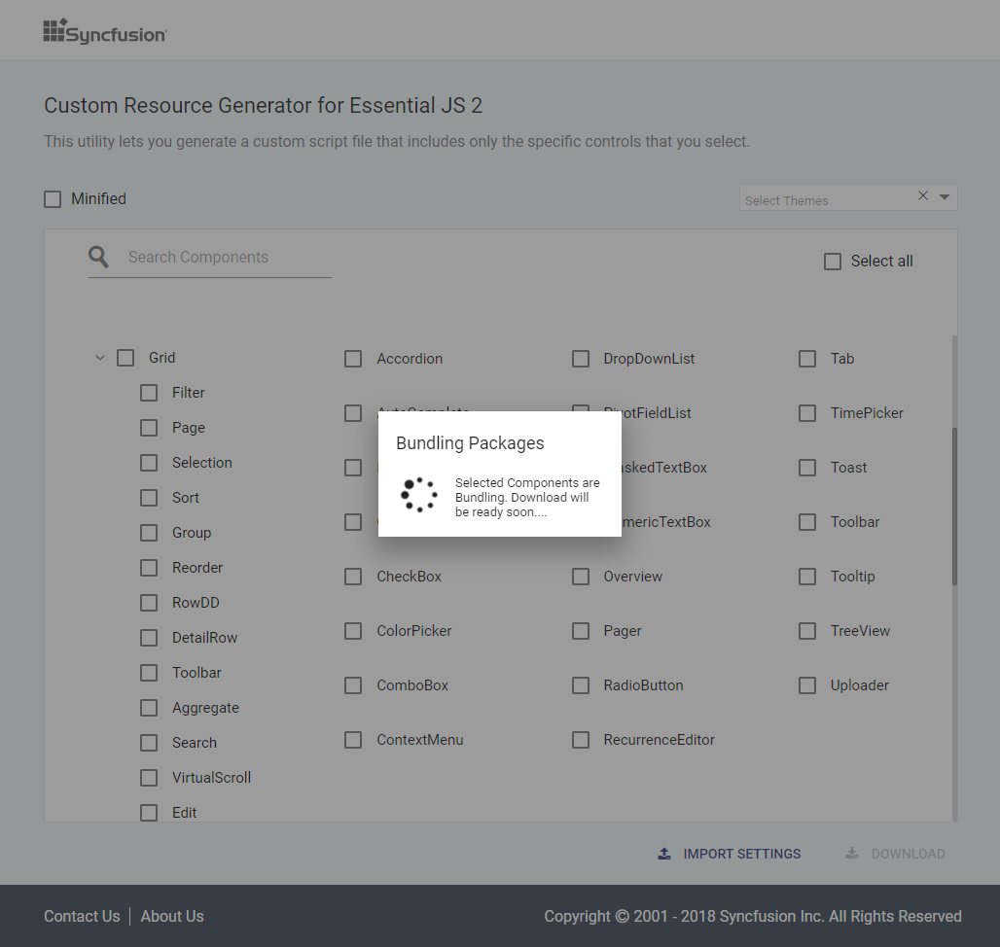
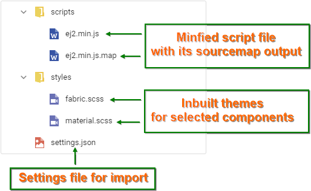
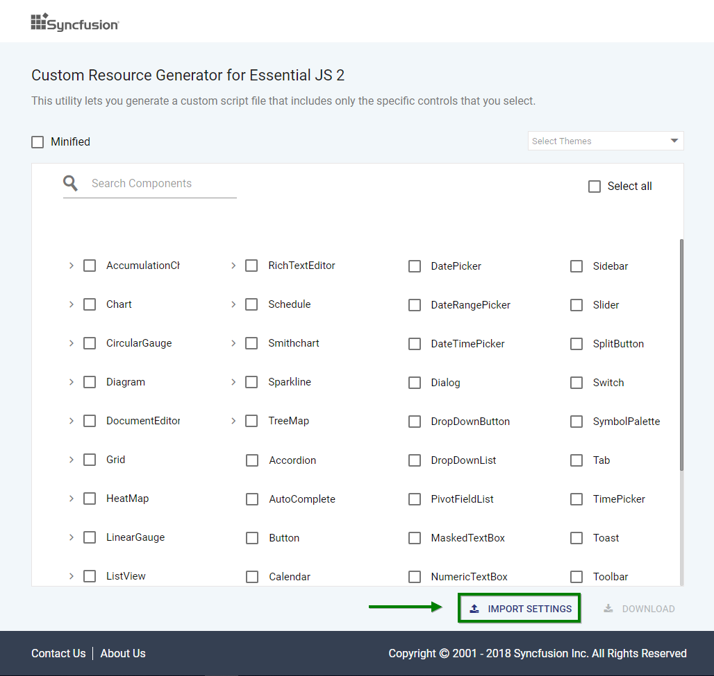

# Custom Resource Generator (Essential JS 2)

Syncfusion provides an option to generate a selective controls script (JavaScript ES5) and styles by using the [`Custom Resource Generator`](https://crg.syncfusion.com/) (CRG) web tool.

## Search and select the control list

Search and select the required Syncfusion controls from the CRG to generate specific set of control resources.

The Syncfusion ASP.NET Core UI controls can be categorized based on the below characteristics.

* Injectable module supported controls
* Injectable module non-supported controls

`Injectable module supported controls` are rendered as treeview with checkbox format and the `Injectable module non-supported controls` are rendered as normal checkbox format in the CRG application.

Refer to the following steps to search and select the controls in CRG.

1.	Navigate to the Custom Resource Generator (CRG) application at [`CRG`](https://crg.syncfusion.com/).

2.	Type the required control name in the search bar and select the check box. The dependency of the selected control is resolved in the application itself, so it does not need to choose each dependent control by manually.

3. Click the expand icon and select the required feature for the injectable module supported controls.

4. If the entire modules of the controls are needed, then click the specific control's check box to select all injectable modules.

5. Select the required built-in themes from the **Select Themes** option. This provides an option to select more than one theme.

## Download the selected control resources

After selecting the required control resources, download the custom script and styles from CRG.

Refer to the following steps to download the custom resources in CRG.

1. Click the **DOWNLOAD** button at the bottom of the page. Select the **Minified** option to generate the minified file output for production.

2. Change the file name as you desire and click **GENERATE** button in the pop-up.

3. Now, the bundling process for the selected controls will be started, and the output will be downloaded as a zip file.

4. The final output contains the script and styles for the selected controls and a **settings.json** file, which stores the current settings.

## Import previously generated settings into the CRG

To add more controls or upgrade the latest Syncfusion ASP.NET Core library resources, it is not necessary to generate it from the scratch in the CRG. Just import the old **settings.json** file and made the changes, then download it again from the CRG application.

Refer to the following steps to import previous settings in the CRG.

1.	Click the **IMPORT SETTINGS** button at the bottom of the page.

2. Upload the **settings.json** file so that the previously stored data will be restored in the CRG application. Now, add more controls and export the resources again.

