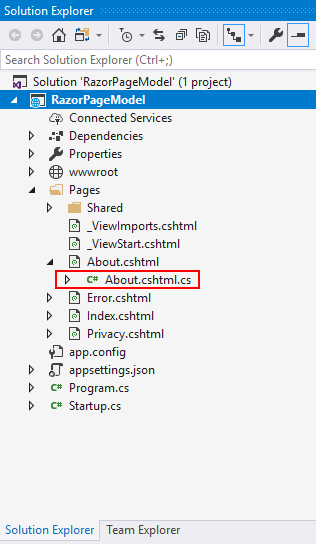

# Model Binding in Razor Pages

This article deals with the model binding of the Razor Pages of the ASP.NET Core platform. 

## PageModel

PageModel is a feature of ASP.NET Core that is used to make possible the separation of concerns between the UI layer and the data logic layer directly with a code-behind file without the controller. 

## PageModel Class

The PageModel class is declared in a separate file and the `About.cshtml` PageModel file is named as `About.cshtml.cs` in the same namespace.



The PageModel classes will be named as the view file name with "Model" as a suffix. The PageModel class for About.cshtml will be called AboutModel.


## Defining Model in PageModel Class

Declare the data property as public property in PageModel class of the Razor Page which is illustrated below. 

```csharp

    //PageModel Class
    public class AboutModel : PageModel
    {
        //Input Date for Calendar
        public DateTime? Date { get; set; } = new DateTime();
        //Default value for DropDown List
        public string Game { get; set; } = "American Football";
        public void OnGet()
        {   
        }
    }

```

## Referring PageModel in Razor Page

The PageModel class is made available to the view file via the @model directive to link the information in the PageModel to Syncfusion EJ2 ASP.NET Core Components. The code block below looks like the Razor View file, except for the @page directive. The @page Directive allows the MVC action to process the request directly without going through the controller. @Page is supposed to be the first directive on the page.

```html

@*Referring required directives*@
@page
@model IndexModel
@using RazorPagesApp.Pages
@{
    ViewData["Title"] = "Home page";
}

<ejs-timepicker id="timepicker" ejs-for="@Model.Date" name="value"></ejs-timepicker>

<ejs-autocomplete id="games"  dataSource="@DataSource.GamesData" ejs-for="@Model.Game"placeholder="e.g. Basketball"></ejs-autocomplete>


```