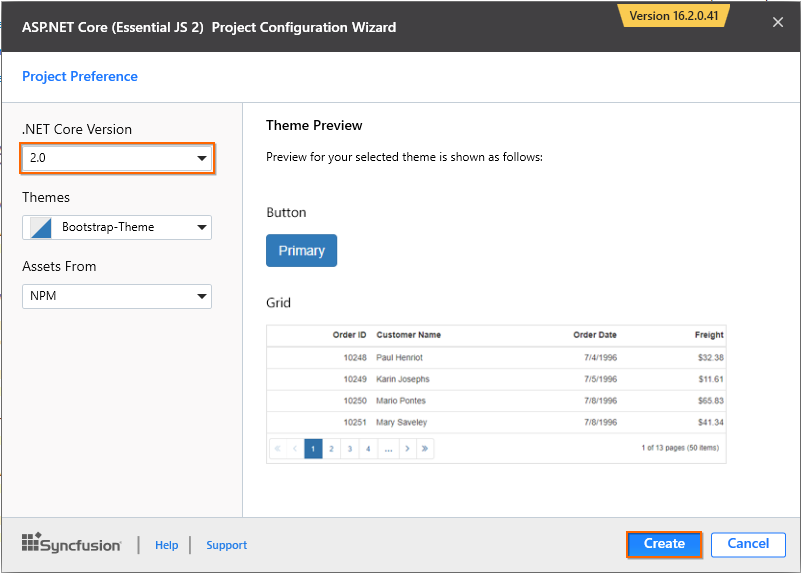
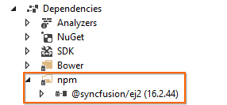
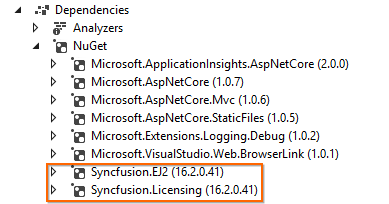

<!-- markdownlint-disable MD024 -->

# Getting Started with Essential JS 2 for ASP.NET Core and Syncfusion Project Template

Syncfusion provides the **Visual Studio Project Templates** to create a Syncfusion ASP.NET Core web application with preconfigured Essential JS 2 settings.

> The Syncfusion ASP.NET Core (Essential JS 2) project templates are available from `v16.2.0.41` of Essential Studio.
> Starting with v16.2.0.x, if you reference to Syncfusion assemblies from trial setup or NuGet feed, you should include a license key in your projects. Refer to this [link](https://help.syncfusion.com/common/essential-studio/licensing/license-key) to learn about registering Syncfusion license key in your ASP.NET Core application to use our components.

## Getting Started with ASP.NET Core 2.x

### Prerequisites

The official prerequisites to create and run an ASP.NET Core 2.x application on Windows environment are described in the [.NET Core documentation website](https://docs.microsoft.com/en-us/dotnet/core/windows-prerequisites?tabs=netcore2x).

* Essential Studio for [ASP.NET Core (Essential JS 2)](https://www.syncfusion.com/downloads/aspnetcore-js2/)

The following steps help you to create a **Syncfusion ASP.NET Core (Essential JS 2) Application** through the **Visual Studio Project Template:**

### Create an ASP.NET Core web application

1. To create a Syncfusion ASP.NET Core (Essential JS 2) project, choose **File > New > Project > Syncfusion ASP.NET Core (Essential JS 2) Web Application** in **Visual Studio**.

    

2. Name the **Project** and choose the destination location.

3. Set the framework of the project and click **OK**. The Project Configuration Wizard appears.

    > Minimum target framework is 4.5 for Syncfusion ASP.NET Core (Essential JS 2) Project Templates.

4. Choose the options to configure the Syncfusion ASP.NET Core (Essential JS 2) application by using the following Project Configuration dialog.

    **.NET Core Version:** Select the version of ASP.NET Core project as ASP.NET Core 2.0.

    **Assets From:** Load the Syncfusion Essential JS 2 assets from ASP.NET Core project such as NPM, CDN, or installed location.

    > The installed location option is available only when the Syncfusion Essential JavaScript 2 setup has been installed.

    **Theme Selection:** Choose the required theme.

    

5. Click **Create**, the Syncfusion ASP.NET Core (Essential JS 2) application is created. The required Syncfusion Essential JS 2 NuGet/NPM packages, Scripts, and CSS have been added to the new project.

    

    If you are choosing assets from `NPM` packages, then it will be installed in the `Dependencies`.

    

    If you are choosing assets from `Installed Location`, then it will be installed in the `wwwroot`.

    

    All the required packages are installed and the Essential JS 2 settings are configured automatically in your new application.

6. Now, you can add the Syncfusion Essential JS 2 components directly in any web page (`cshtml`) in the `Views` folder and run the application.

    For example, the calendar component is added to the `~/Views/Home/Index.cshtml` page.

    ```html
    <div>
        <ejs-calendar id="calendar"></ejs-calendar>
    </div>
    ```

    The final output of Essential JS 2 calendar component in the web browser is shown as follows.

    

## Getting Started with ASP.NET Core 1.x

### Prerequisites

The official prerequisites to create and run an ASP.NET Core 1.x application on Windows environment are described in the [.NET Core documentation website](https://docs.microsoft.com/en-us/dotnet/core/windows-prerequisites?tabs=netcore1x).

* Essential Studio for [ASP.NET Core (Essential JS 2)](https://www.syncfusion.com/downloads/aspnetcore-js2/)

The following steps direct you to create a **Syncfusion ASP.NET Core (Essential JS 2) Application** through the **Visual Studio Project Template:**

### Create ASP.NET Core web application

1. To create a Syncfusion ASP.NET Core (Essential JS 2) project, choose **File > New > Project > Syncfusion ASP.NET Core (Essential JS 2) Web Application** in **Visual Studio**.

    

2. Name the **Project** and choose the destination location.

3. Set the framework of the project and click **OK**. The Project Configuration Wizard appears.

   > Minimum target framework is 4.5 for Syncfusion ASP.NET Core (Essential JS 2) project templates.

4. Choose the options to configure the Syncfusion ASP.NET Core (Essential JS 2) application by using the following Project Configuration dialog.

    **.NET Core Version:** Select the version of ASP.NET Core Project either as ASP.NET Core 1.0 or ASP.NET Core 1.1.

    **Assets From:** Load the Syncfusion Essential JS 2 assets from ASP.NET Core Project such as NPM, CDN or installed location.

    > The installed location option is available only when the Syncfusion Essential JavaScript 2 setup has been installed.

    **Theme Selection:** Choose the required theme.

    

5. Click **Create**, the Syncfusion ASP.NET Core (Essential JS 2) application is created.

6. Required Syncfusion Essential JS 2 NuGet/NPM packages, Scripts, and CSS have been added to the new Project.

    

    If you choose assets from `NPM` packages, then it will be installed in the `Dependencies`.

    

    If you choose assets from `Installed Location`, then it will be installed in the `wwwroot`.

    

    Now, all the required packages are installed and the Essential JS 2 settings are configured automatically in your new application.

7. You can add the Syncfusion Essential JS 2 components directly in any web page (`cshtml`) in the `Views` folder and run the application.

    For example, the calendar component is added to the `~/Views/Home/Index.cshtml` page.

    ```html
    <div>
        <ejs-calendar id="calendar"></ejs-calendar>
    </div>
    ```

    The final output of Essential JS 2 calendar component in the web browser is shown as follows.

    
