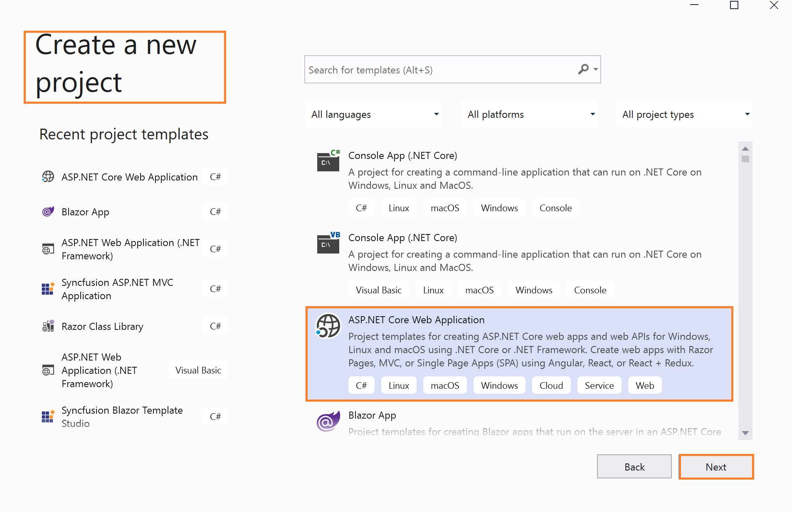
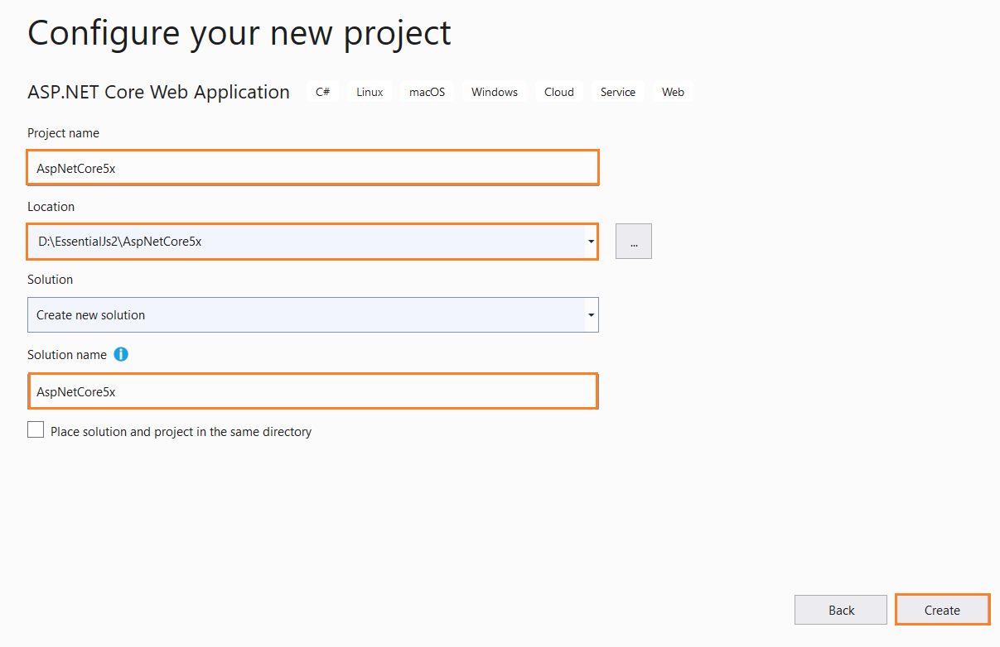
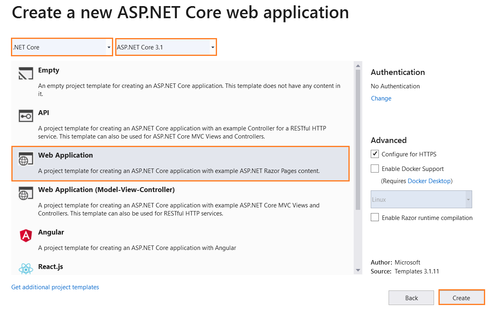
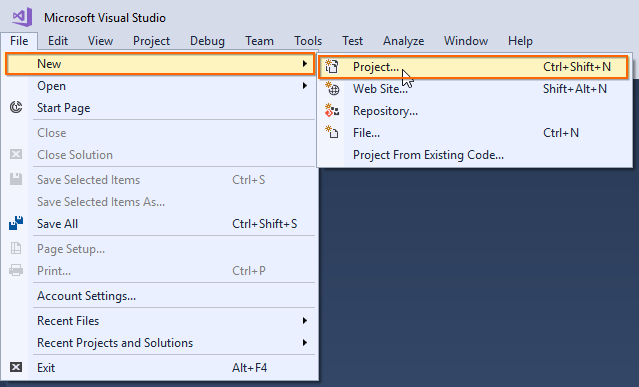

# Getting Started with Essential JS 2 for ASP.NET Core and Razor Pages

This article provides a step-by-step introduction to configure Essential JS 2 setup and build a simple .NET Core web application with Razor pages using [Visual Studio](https://visualstudio.microsoft.com/downloads/).

> Starting with v16.2.0.x, if you reference to Syncfusion assemblies from trial setup or NuGet feed, you should include a license key in your projects. Refer to this [link](https://help.syncfusion.com/common/essential-studio/licensing/license-key) to learn about registering Syncfusion license key in your ASP.NET Core application to use the components.

## Getting Started with ASP.NET Core 5.x

### Prerequisites

The official prerequisites to create and run an ASP.NET Core 5.0 application on windows environment are described in the [.NET Core documentation website](https://docs.microsoft.com/en-us/aspnet/core/tutorials/razor-pages/razor-pages-start?view=aspnetcore-5.0&tabs=visual-studio#prerequisites).

### Create ASP.NET Core web application with Razor pages

1. Open the Visual Studio and click the **File** menu and select **New -> Project** option.

    

2. Select **ASP.NET Core Web Application** templates in visual studio 2019.

    

3. Change the Application name and then click **Create**.

    

4. Choose .NET Core with ASP.NET Core 5.0 and select **ASP.NET Core Web App**, and then click **Create**. The web application project is now created with default ASP.NET Core template.

    

### Configure Essential JS 2 in the application

1. Add the [`Syncfusion.EJ2.AspNet.Core`](https://www.nuget.org/packages/Syncfusion.EJ2.AspNet.Core/) NuGet package to the new application by using the Nuget Packge Manager. Right-click the project and select the **Manage Nuget Packages...**.

    > Refer to [this article](../nuget-packages) to learn more details about installing Essential JS 2 NuGet packages in various OS environment.

    

2. Search the `Syncfusion.EJ2.AspNet.Core` keyword in the **Browser** tab and install **Syncfusion.EJ2.AspNet.Core** NuGet package in the application.

    

    The Essential JS 2 package will be included in the project, after the installation process is completed.

    > **Note:** The Syncfusion.EJ2.AspNet.Core NuGet package has dependencies, [`Newtonsoft.Json`](https://www.nuget.org/packages/Newtonsoft.Json/) for JSON serialization and [`Syncfusion.Licensing`](https://www.nuget.org/packages/Syncfusion.Licensing/) for validating Syncfusion license key.

3. Open `~/Views/_ViewImports.cshtml` file and import the `Syncfusion.EJ2` TagHelper.

    ```html
    @addTagHelper *, Syncfusion.EJ2
    ```
4. Add the client-side resources through [CDN](https://ej2.syncfusion.com/documentation/base/deployment.html?lang=typescript#cdn) or [local npm package](https://www.npmjs.com/package/@syncfusion/ej2) in the `<head>` element of `~/Pages/Shared/_Layout.cshtml` layout page.

    ```html
    <head>
        ....
        ....

        <!-- Syncfusion Essential JS 2 Styles -->
        <link rel="stylesheet" href="https://cdn.syncfusion.com/ej2/material.css" />

        <!-- Syncfusion Essential JS 2 Scripts -->
        <script src="https://cdn.syncfusion.com/ej2/dist/ej2.min.js"></script>
    </head>
    ```

5. Add the Essential JS 2 Script Manager at the end of `<body>` element in the `~/Pages/Shared/_Layout.cshtml` layout page.

    ```html
    <body>
        ....
        ....
        <!-- Syncfusion Essential JS 2 ScriptManager -->
        <ejs-scripts></ejs-scripts>
    </body>
    ```

6. Now, you can add the Syncfusion Essential JS 2 components in any web page (`cshtml`) in the `Pages` folder.

    For example, the calendar component is added to the `~/Pages/Index.cshtml` page.

    ```html
    <div>
        <ejs-calendar id="calendar"></ejs-calendar>
    </div>
    ```

7. Run the application. The Essential JS 2 calendar component will render in the web browser.

    

## Getting Started with ASP.NET Core 3.x

### Prerequisites

The official prerequisites to create and run an ASP.NET Core 3.x application on windows environment are described in the [.NET Core documentation website](https://docs.microsoft.com/en-us/aspnet/core/tutorials/razor-pages/razor-pages-start?view=aspnetcore-3.1&tabs=visual-studio#prerequisites).

### Create ASP.NET Core web application with Razor pages

1. Open the Visual Studio and click the **File** menu and select **New -> Project** option.

    

2. Select **ASP.NET Core Web Application** templates in visual studio 2019.

    

3. Change the Application name and then click **Create**.

    

4. Choose .NET Core with ASP.NET Core 3.1 and select **Web Application**, and then click **Create**. The web application project is now created with default ASP.NET Core template.

    

### Configure Essential JS 2 in the application

1. Add the [`Syncfusion.EJ2.AspNet.Core`](https://www.nuget.org/packages/Syncfusion.EJ2.AspNet.Core/) NuGet package to the new application by using the Nuget Packge Manager. Right-click the project and select the **Manage Nuget Packages...**.

    > Refer to [this article](../nuget-packages) to learn more details about installing Essential JS 2 NuGet packages in various OS environment.

    

2. Search the `Syncfusion.EJ2.AspNet.Core` keyword in the **Browser** tab and install **Syncfusion.EJ2.AspNet.Core** NuGet package in the application.

    

    The Essential JS 2 package will be included in the project, after the installation process is completed.

    > **Note:** The Syncfusion.EJ2.AspNet.Core NuGet package has dependencies, [`Newtonsoft.Json`](https://www.nuget.org/packages/Newtonsoft.Json/) for JSON serialization and [`Syncfusion.Licensing`](https://www.nuget.org/packages/Syncfusion.Licensing/) for validating Syncfusion license key.

3. Open `~/Views/_ViewImports.cshtml` file and import the `Syncfusion.EJ2` TagHelper.

    ```html
    @addTagHelper *, Syncfusion.EJ2
    ```
4. Add the client-side resources through [CDN](https://ej2.syncfusion.com/documentation/base/deployment.html?lang=typescript#cdn) or [local npm package](https://www.npmjs.com/package/@syncfusion/ej2) in the `<head>` element of `~/Pages/Shared/_Layout.cshtml` layout page.

    ```html
    <head>
        ....
        ....

        <!-- Syncfusion Essential JS 2 Styles -->
        <link rel="stylesheet" href="https://cdn.syncfusion.com/ej2/material.css" />

        <!-- Syncfusion Essential JS 2 Scripts -->
        <script src="https://cdn.syncfusion.com/ej2/dist/ej2.min.js"></script>
    </head>
    ```

5. Add the Essential JS 2 Script Manager at the end of `<body>` element in the `~/Pages/Shared/_Layout.cshtml` layout page.

    ```html
    <body>
        ....
        ....
        <!-- Syncfusion Essential JS 2 ScriptManager -->
        <ejs-scripts></ejs-scripts>
    </body>
    ```

6. Now, you can add the Syncfusion Essential JS 2 components in any web page (`cshtml`) in the `Pages` folder.

    For example, the calendar component is added to the `~/Pages/Index.cshtml` page.

    ```html
    <div>
        <ejs-calendar id="calendar"></ejs-calendar>
    </div>
    ```

7. Run the application. The Essential JS 2 calendar component will render in the web browser.

    

## Getting Started with ASP.NET Core 2.x

### Prerequisites

The official prerequisites to create and run an ASP.NET Core 2.x application on Windows environment are described in the [.NET Core documentation website](https://docs.microsoft.com/en-us/aspnet/core/tutorials/razor-pages/razor-pages-start?view=aspnetcore-2.0#prerequisites-1).

### Create ASP.NET Core web application with Razor pages

1. Choose **File > New > Project...** in the Visual Studio menu bar.

    

2. Select **Installed > Visual C# > .NET Core** and choose the required **.NET Framework** in the drop-down.

3. Select **ASP.NET Core Web Application** and change the application name and click **OK**.

    > The Essential JS 2 supports 4.5+ .NET Framework in the ASP.NET Core application. i.e. The minimum target framework is 4.5 for Syncfusion ASP.NET Core (Essential JS 2).

    

4. Choose **.NET Core** with **ASP.NET Core 2.0** and select **Web Application**, and then click **OK**. Now, the web application project is created with default ASP.NET Core template.

    

### Configure Essential JS 2 in the application

1. Add the [`Syncfusion.EJ2.AspNet.Core`](https://www.nuget.org/packages/Syncfusion.EJ2.AspNet.Core/) NuGet package to the new application by using the Nuget Package Manager. Right-click the project and select **Manage NuGet Packages...**.

    > Refer to [this article](../nuget-packages) to learn more details about installing Essential JS 2 NuGet packages in various OS environment.

    

2. Search the `Syncfusion.EJ2.AspNet` in the **Browse** tab and install **Syncfusion.EJ2.AspNet.Core** NuGet package in the application.

    

    The Essential JS 2 package will be included in the project, after the installation process is completed.

    > **Note:** The Syncfusion.EJ2.AspNet.Core NuGet package has dependencies, [`Newtonsoft.Json`](https://www.nuget.org/packages/Newtonsoft.Json/) for JSON serialization and [`Syncfusion.Licensing`](https://www.nuget.org/packages/Syncfusion.Licensing/) for validating Syncfusion license key.

3. Open the `~/Pages/_ViewImports.cshtml` file and import the `Syncfusion.EJ2` package.

    ```html
    @addTagHelper *, Syncfusion.EJ2
    ```

4. Add the client-side resources through [CDN](https://ej2.syncfusion.com/documentation/base/deployment.html?lang=typescript#cdn) or [local npm package](https://www.npmjs.com/package/@syncfusion/ej2) in the `<head>` element of `~/Pages/_Layout.cshtml` layout page.

    ```html
    <head>
        ....
        ....

        <!-- Syncfusion Essential JS 2 Styles -->
        <link rel="stylesheet" href="https://cdn.syncfusion.com/ej2/material.css" />

        <!-- Syncfusion Essential JS 2 Scripts -->
        <script src="https://cdn.syncfusion.com/ej2/dist/ej2.min.js"></script>
    </head>
    ```

5. Add the Essential JS 2 Script Manager at the end of `<body>` element in the `~/Pages/_Layout.cshtml` layout page.

    ```html
    <body>
        ....
        ....
        <!-- Syncfusion Essential JS 2 ScriptManager -->
        <ejs-scripts></ejs-scripts>
    </body>
    ```

6. Now, you can add the Syncfusion Essential JS 2 components in any web page (`cshtml`) in the `Pages` folder.

    For example, the calendar component is added to the `~/Pages/Index.cshtml` page.

    ```html
    <div>
        <ejs-calendar id="calendar"></ejs-calendar>
    </div>
    ```

7. Run the application. The Essential JS 2 calendar component will render in the web browser.

    
