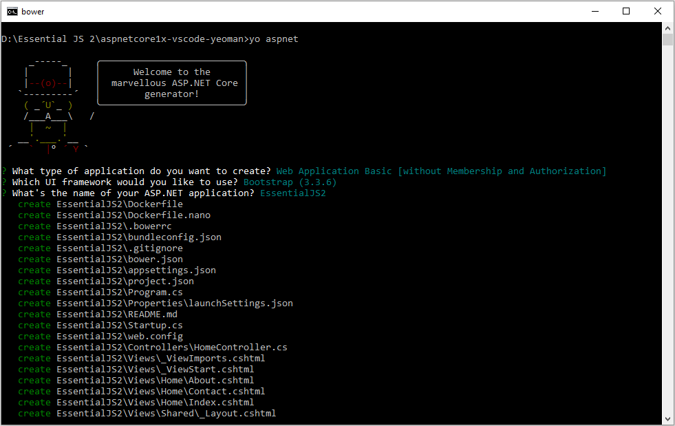
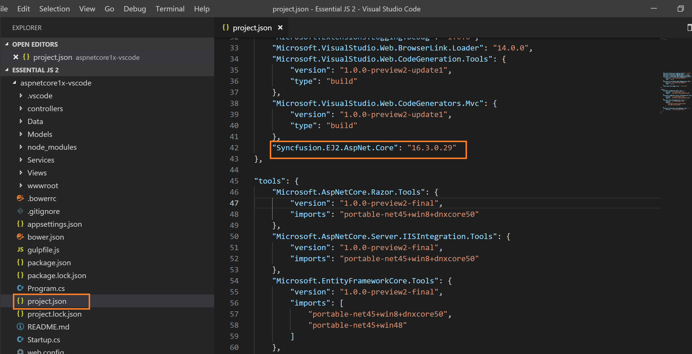
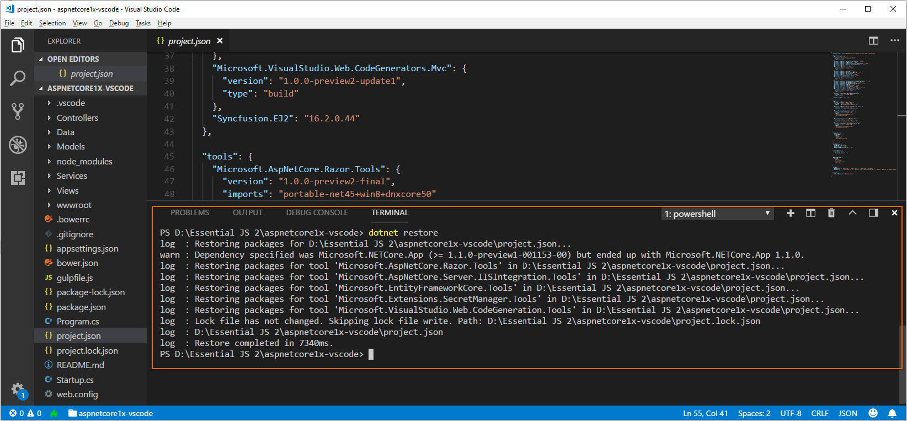

<!-- markdownlint-disable MD024 -->

# Getting Started with Essential JS 2 for ASP.NET Core and Yeoman tool in Visual Studio Code

This article provides a step-by-step introduction to configure Essential JS 2 setup and build a simple .NET Core web application using the [Yeoman tool](http://yeoman.io/#) in [Visual Studio Code](https://code.visualstudio.com/) (VS Code).

> Starting with v16.2.0.x, if you reference to Syncfusion assemblies from trial setup or NuGet feed, you should include a license key in your projects. Refer to this [link](https://help.syncfusion.com/common/essential-studio/licensing/license-key) to learn about registering Syncfusion license key in your ASP.NET Core application to use the components.

## Getting Started with ASP.NET Core 2.x

### Prerequisites

The official prerequisites to create and run an ASP.NET Core 2.x application on Windows environment are described in the [.NET Core documentation website](https://docs.microsoft.com/en-us/dotnet/core/windows-prerequisites?tabs=netcore2x).

* [Visual Studio Code](https://code.visualstudio.com/)
* [Node.js](https://nodejs.org/en/)

### Create ASP.NET Core web application

1. Open Command prompt from the desired location and run the following command to install the required npm plugins with global flag.

    ```cmd
    npm install -g yo generator-aspnet gulp bower
    ```

2. After installing the Yeoman generator successfully, run the following command to invoke a ASP.NET Core project creation wizard.

    ```cmd
    yo aspnet
    ```

    

3. Select **Web Application Basic [without Membership and Authorization]** option and choose the **Bootstrap (3.3.7)** framework, and then type the web application name for the new application. For example, a new application is created as `EssentialJS2`.

    You can navigate the options by using <kbd>top</kbd> and <kbd>bottom</kbd> arrow keys and then press <kbd>Enter</kbd> key to select the option.

    

4. Now, a new application is created in a new folder with the provided application name. Open the application in the VS Code and Select **View > Integrated Terminal** to open the terminal in VS Code.

    

### Configure Essential JS 2 in the application

1. Run the following command in the VS Code terminal to add `Syncfusion.EJ2.AspNet.Core` NuGet package in the project.

    ```cmd
    dotnet add package Syncfusion.EJ2.AspNet.Core
    ```

    

    > Refer to [here](https://docs.microsoft.com/en-us/dotnet/core/tools/dotnet-add-package), to learn more details about `dotnet add` command line.

2. Open `~/Views/_ViewImports.cshtml` file and import the `Syncfusion.EJ2` package.

    ```html
    @addTagHelper *, Syncfusion.EJ2
    ```

3. Add the client-side resources through [CDN](https://ej2.syncfusion.com/documentation/base/deployment.html?lang=typescript#cdn) or [local npm package](https://www.npmjs.com/package/@syncfusion/ej2) in the `<head>` element of `~/Views/Shared/_Layout.cshtml` layout page.

    ```html
    <head>
        ....
        ....

        <!-- Syncfusion Essential JS 2 Styles -->
        <link rel="stylesheet" href="https://cdn.syncfusion.com/ej2/material.css" />

        <!-- Syncfusion Essential JS 2 Scripts -->
        <script src="https://cdn.syncfusion.com/ej2/dist/ej2.min.js"></script>
    </head>
    ```

4. Add the Essential JS 2 Script Manager at the end of `<body>` element in the `~/Views/Shared/_Layout.cshtml` layout page.

    ```html
    <body>
        ....
        ....
        <!-- Syncfusion Essential JS 2 ScriptManager -->
        <ejs-scripts></ejs-scripts>
    </body>
    ```

5. Add the Syncfusion Essential JS 2 components in any web page (`cshtml`) in the `Views` folder.

    For example, the calendar component is added to the `~/Views/Home/Index.cshtml` page.

    ```html
    <div>
        <ejs-calendar id="calendar"></ejs-calendar>
    </div>
    ```

6. Run the application by pressing <kbd>F5</kbd> key. Set `Select Environment` to `.NET Core`, if setting required VS Code.

    

    The Essential JS 2 calendar component will render in the web browser.

    

## Getting Started with ASP.NET Core 1.x

### Prerequisites

The official prerequisites to create and run an ASP.NET Core 1.x application on Windows environment are described in the [.NET Core documentation website](https://docs.microsoft.com/en-us/dotnet/core/windows-prerequisites?tabs=netcore1x).

* [Visual Studio Code](https://code.visualstudio.com/)
* [Node.js](https://nodejs.org/en/)

### Create ASP.NET Core web application

1. Open Command prompt from the desired location and run the following command to install the required npm plugins with global flag.

    ```cmd
    npm install -g yo generator-aspnet@0.2.6 gulp bower
    ```

    > Ensure the `generator-aspnet` plugin version as 0.2.6, which supports the ASP.NET Core 1.x version.

2. After installing the Yeoman generator successfully, run the following command to invoke a ASP.NET Core project creation wizard.

    ```cmd
    yo aspnet
    ```

    

3. Select **Web Application Basic [without Membership and Authorization]** option and choose the **Bootstrap (3.3.7)** framework, and then type the web application name for the new application. For example, a new application is created as `EssentialJS2`.

    You can navigate the options by using <kbd>top</kbd> and <kbd>bottom</kbd> arrow keys and then press <kbd>Enter</kbd> key to select the option.

    

### Configure Essential JS 2 in the application

1. Now, a new application is created in a new folder with the provided application name. Open the application in the VS Code and add `Syncfusion.EJ2` assembly reference in the `dependencies` of `project.json` file.

    

2. Select **View > Integrated Terminal** to open the terminal in VS Code.

    

3. Restore the dependent packages in the application by running the following command line in the VS Code terminal.

    ```cmd
    dotnet restore
    ```

    

    > Refer to [here](https://docs.microsoft.com/en-us/dotnet/core/tools/dotnet-restore?tabs=netcore1x), to know more details about `dotnet restore` command line.

4. Open the `~/Views/_ViewImports.cshtml` file and import the `Syncfusion.EJ2` package.

    ```html
    @addTagHelper *, Syncfusion.EJ2
    ```

5. Add the client-side resources through [CDN](https://ej2.syncfusion.com/documentation/base/deployment.html?lang=typescript#cdn) or [local npm package](https://www.npmjs.com/package/@syncfusion/ej2) in the `<head>` element of `~/Views/Shared/_Layout.cshtml` layout page.

    ```html
    <head>
        ....
        ....

        <!-- Syncfusion Essential JS 2 Styles -->
        <link rel="stylesheet" href="https://cdn.syncfusion.com/ej2/material.css" />

        <!-- Syncfusion Essential JS 2 Scripts -->
        <script src="https://cdn.syncfusion.com/ej2/dist/ej2.min.js"></script>
    </head>
    ```

6. Add the Essential JS 2 Script Manager at the end of `<body>` element in the `~/Views/Shared/_Layout.cshtml` layout page.

    ```html
    <body>
        ....
        ....
        <!-- Syncfusion Essential JS 2 ScriptManager -->
        <ejs-scripts></ejs-scripts>
    </body>
    ```

7. Add the Syncfusion Essential JS 2 components in any web page (`cshtml`) in the `Views` folder.

    For example, the calendar component is added to the `~/Views/Home/Index.cshtml` page.

    ```html
    <div>
        <ejs-calendar id="calendar"></ejs-calendar>
    </div>
    ```

8. Run the application by pressing <kbd>F5</kbd> key. Set `Select Environment` to `.NET Core`, if settings required VS Code.

    

    The Essential JS 2 calendar component will render in the web browser.

    
