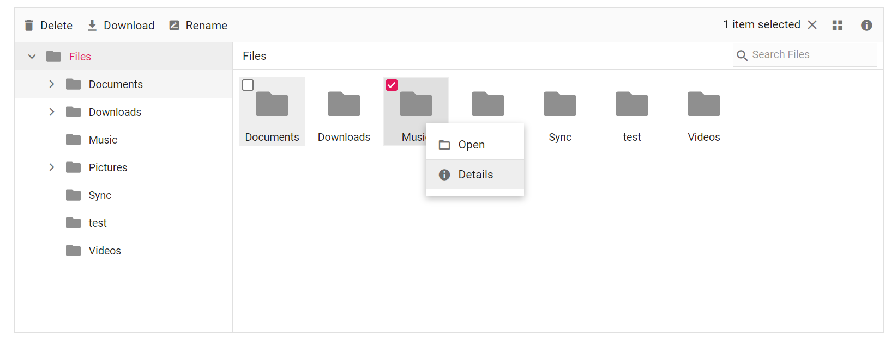
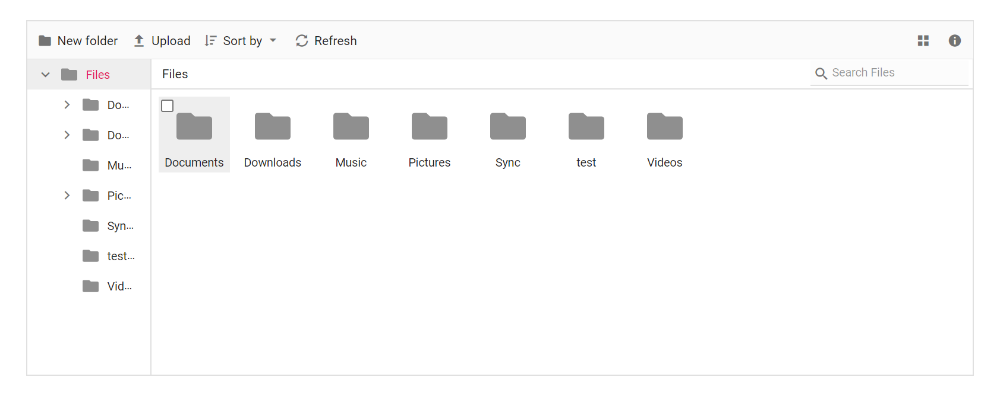
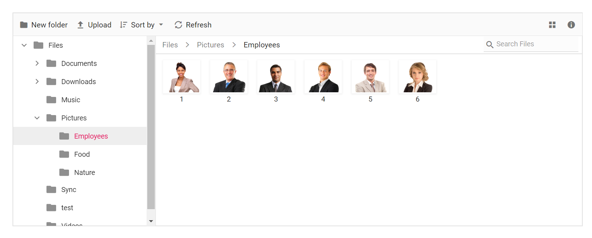
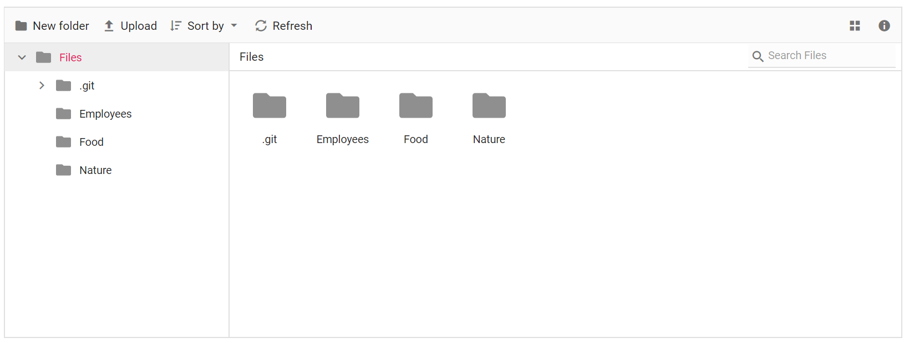
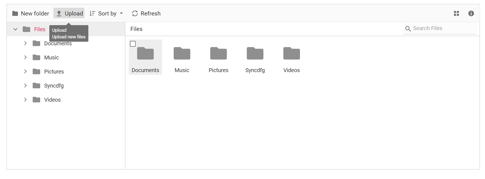

# Customizing File Manager functionalities

The file manager component allows customizing its functionalities like, context menu, searching, uploading, toolbar using APIs. Given below are some of the functionalities that can be customized in the File Manager,

* [Context menu customization](#context-menu-customization)
* [Navigation pane customization](#navigation-pane-customization)
* [Show/Hide file extension](#showhide-file-extension)
* [Show/Hide hidden items](#showhide-hidden-items)
* [Show/Hide thumbnail images in large icons view](#showhide-thumbnail-images-in-large-icons-view)
* [Toolbar customization](#toolbar-customization)
* [Upload customization](#upload-customization)
* [Tooltip customization](#tooltip-customization)

## Context menu customization

The context menu settings like, items to be displayed on files, folders and layout click and visibility can be customized using [contextMenuSettings](https://help.syncfusion.com/cr/aspnetcore-js2/Syncfusion.EJ2~Syncfusion.EJ2.FileManager.FileManager~ContextMenuSettings.html) property.





Output be like the below.

## Navigation pane customization

The navigation pane settings like, minimum and maximum width and visibility can be customized using [navigationPaneSettings](https://help.syncfusion.com/cr/aspnetcore-js2/Syncfusion.EJ2~Syncfusion.EJ2.FileManager.FileManager~NavigationPaneSettings.html) property.





Output be like the below.

## Show/Hide file extension

The file extensions are displayed in the File Manager by default. This can be hidden by disabling the [showFileExtension](https://help.syncfusion.com/cr/aspnetcore-js2/Syncfusion.EJ2~Syncfusion.EJ2.FileManager.FileManager~ShowFileExtension.html) property.

In File Manager [fileLoad](https://help.syncfusion.com/cr/aspnetcore-js2/Syncfusion.EJ2~Syncfusion.EJ2.FileManager.FileManager~FileLoad.html) and [fileOpen](https://help.syncfusion.com/cr/aspnetcore-js2/Syncfusion.EJ2~Syncfusion.EJ2.FileManager.FileManager~FileOpen.html) events are triggered before the file/folder is rendered and before the file/folder is opened respectively. These events can be utilized to perform operations before a file/folder is rendered or opened.





Output be like the below.

## Show/Hide hidden items

The File Manager provides support to show/hide the hidden items by enabling/disabling the [showHiddenItems](https://help.syncfusion.com/cr/aspnetcore-js2/Syncfusion.EJ2~Syncfusion.EJ2.FileManager.FileManager~ShowHiddenItems.html) property.





Output be like the below.

## Show/Hide thumbnail images in large icons view

The thumbnail images are displayed in the File Manager's large icons view by default. This can be hidden by disabling the [showThumbnail](https://help.syncfusion.com/cr/aspnetcore-js2/Syncfusion.EJ2~Syncfusion.EJ2.FileManager.FileManager~ShowThumbnail.html) property.





Output be like the below.

## Toolbar customization

The toolbar settings like, items to be displayed in toolbar and visibility can be customized using [toolbarSettings](https://help.syncfusion.com/cr/aspnetcore-js2/Syncfusion.EJ2~Syncfusion.EJ2.FileManager.FileManager~ToolbarSettings.html) property.





Output be like the below.

## Upload customization

The upload settings like, minimum and maximum file size and enabling auto upload can be customized using [uploadSettings](https://help.syncfusion.com/cr/aspnetcore-js2/Syncfusion.EJ2~Syncfusion.EJ2.FileManager.FileManager~UploadSettings.html) property.





Output be like the below, when file size is below the `minFileSize`.

Output be like the below, when file size is above the `minFileSize`.

## Tooltip customization

The tooltip value can be customized by adding extra content to the title of the toolbar, navigation pane, details view and large icons of the file manager element.





Output be like the below.

