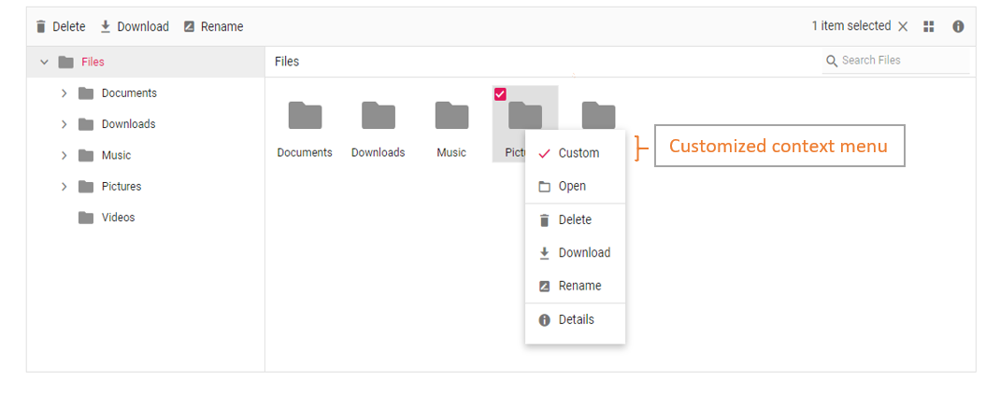

# How to add custom menu item in context menu

The context menu can be customized using the [contextMenuSettings](https://help.syncfusion.com/cr/aspnetcore-js2/Syncfusion.EJ2~Syncfusion.EJ2.FileManager.FileManager~ContextMenuSettings.html),[`menuOpen`](https://help.syncfusion.com/cr/aspnetcore-js2/Syncfusion.EJ2~Syncfusion.EJ2.FileManager.FileManager~MenuOpen.html), and [`menuClick`](https://help.syncfusion.com/cr/aspnetcore-js2/Syncfusion.EJ2~Syncfusion.EJ2.FileManager.FileManager~MenuClick.html) events.

The following example shows adding a custom item in the context menu.

The [`menuOpen`](https://help.syncfusion.com/cr/aspnetcore-js2/Syncfusion.EJ2~Syncfusion.EJ2.FileManager.FileManager~MenuOpen.html) event is used to add the new menu item. The [`menuClick`](https://help.syncfusion.com/cr/aspnetcore-js2/Syncfusion.EJ2~Syncfusion.EJ2.FileManager.FileManager~MenuClick.html) event is used to add event handler to the new menu item.





Output be like the below.

