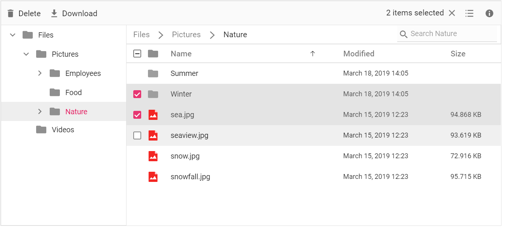

# Multiple Selection

The file manager allows you to select multiple files by enabling the [`allowMultiSelection`](https://help.syncfusion.com/cr/aspnetcore-js2/Syncfusion.EJ2~Syncfusion.EJ2.FileManager.FileManager~AllowMultiSelection.html) property (enabled by default). The multiple selection can be done by pressing the `Ctrl` key or `Shift` key and selecting the files. The check box can also be used to do multiple selection. `Ctrl + A` can be used to select all files in the current directory. The [`fileSelect`](https://help.syncfusion.com/cr/aspnetcore-js2/Syncfusion.EJ2~Syncfusion.EJ2.FileManager.FileManager~FileSelect.html) event will be triggered when the items of file manager control is selected or unselected.

The below example shows File manager allows you to select multiple files using [`allowMultiSelection`](https://help.syncfusion.com/cr/aspnetcore-js2/Syncfusion.EJ2~Syncfusion.EJ2.FileManager.FileManager~AllowMultiSelection.html) property.





Output be like the below.

