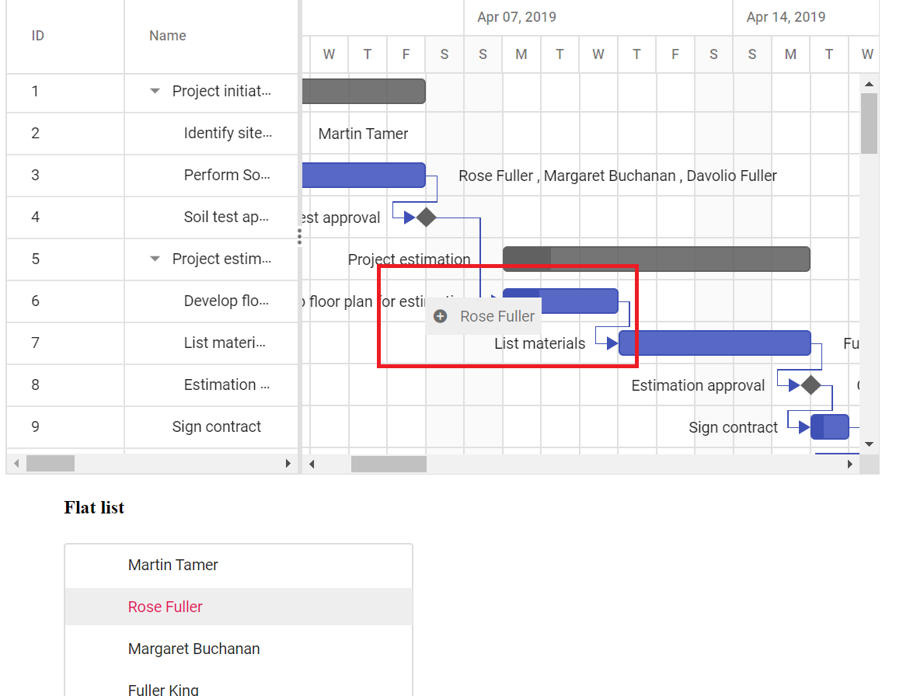

# Drag and Drop the Record from another component to Gantt

In Gantt, it is possible to drag a record from another component and drop it in Gantt chart with updating the Gantt record. Here, dragging an item from `TreeView` component to Gantt and that item is updated as a resource for the Gantt record, we can achieve this, by using [`nodeDragStop`](../../api/treeview/#nodedragstop) event of `TreeView` control.





The following screenshot shows dropping record from another component in to Gantt, and **Rose Fuller** is added as resource for the task **Develop floor plan estimation**.

