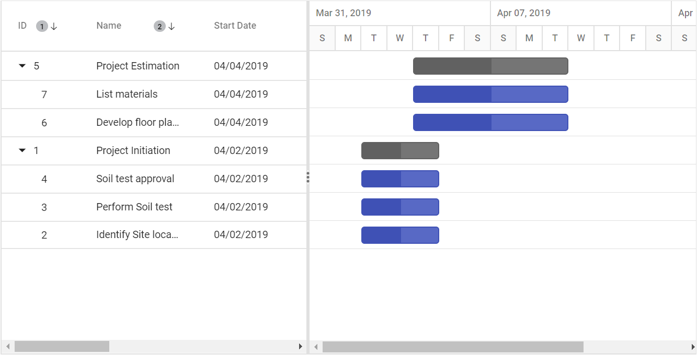

# Sorting

Sorting enables you to sort data in the ascending or descending order. To sort a column, click the column header.

To sort multiple columns, press and hold the CTRL key and click the column header. You can clear sorting of any one of the multi-sorted columns by pressing and holding the SHIFT key and clicking the specific column header.

To enable sorting in the Gantt control, set the [`AllowSorting`](https://help.syncfusion.com/cr/aspnetcore-js2/Syncfusion.EJ2.Gantt.Gantt.html#Syncfusion_EJ2_Gantt_Gantt_AllowSorting) property to true. Sorting options can be configured through the [`SortSettings`](https://help.syncfusion.com/cr/aspnetcore-js2/Syncfusion.EJ2.Gantt.Gantt.html#Syncfusion_EJ2_Gantt_Gantt_SortSettings) property.





The following screenshot shows the output of multicolumn sorting in Gantt control.

> * Gantt columns are sorted in the ascending order. If you click the already sorted column, the sort direction toggles.
> * To disable sorting for a particular column, set the [`Columns.AllowSorting`](https://help.syncfusion.com/cr/aspnetcore-js2/Syncfusion.EJ2.Gantt.GanttColumn.html#Syncfusion_EJ2_Gantt_GanttColumn_AllowSorting) property to false.

## Sorting column on Gantt initialization

The Gantt control can be rendered with sorted columns initially, and this can be achieved by using the [`SortSettings`](https://help.syncfusion.com/cr/aspnetcore-js2/Syncfusion.EJ2.Gantt.Gantt.html#Syncfusion_EJ2_Gantt_Gantt_SortSettings) property. You can add columns that are sorted initially in the [`SortSettings.Columns`](https://help.syncfusion.com/cr/aspnetcore-js2/Syncfusion.EJ2.Gantt.GanttSortSettings.html#Syncfusion_EJ2_Gantt_GanttSortSettings_Columns) collection defined with `Field` and `Direction` properties. The following code example shows how to add the sorted column to Gantt initialization.





## Sorting column dynamically

Columns in the Gantt control can be sorted dynamically using the `sortColumn` method. The following code example demonstrates how to invoke the `sortColumn` method by clicking the custom button.





Before Sorting

After Sorting

## Clear all the sorted columns dynamically

In the Gantt control, you can clear all the sorted columns and return to previous position using the `clearSorting` public method. The following code snippet shows how to clear all the sorted columns by clicking the custom button.





## Sorting events

During the sort action, the Gantt control triggers two events. The [`ActionBegin`](https://help.syncfusion.com/cr/aspnetcore-js2/Syncfusion.EJ2.Gantt.Gantt.html#Syncfusion_EJ2_Gantt_Gantt_ActionBegin) event triggers before the sort action starts, and the [`ActionComplete`](https://help.syncfusion.com/cr/aspnetcore-js2/Syncfusion.EJ2.Gantt.Gantt.html#Syncfusion_EJ2_Gantt_Gantt_ActionComplete) event triggers after the sort action is completed.





> The `args.requestType` is the current action name. For example, for sorting the `args.requestType`, value is **sorting**.

## Sorting Custom Columns

In Gantt, you can sort custom columns of different types like string, numeric, etc., By adding the custom column in the column collection, you can perform initial sort using the `sortSettings` or you can also sort the column dynamically by a button click.

The following code snippets explains how to achieve this.



