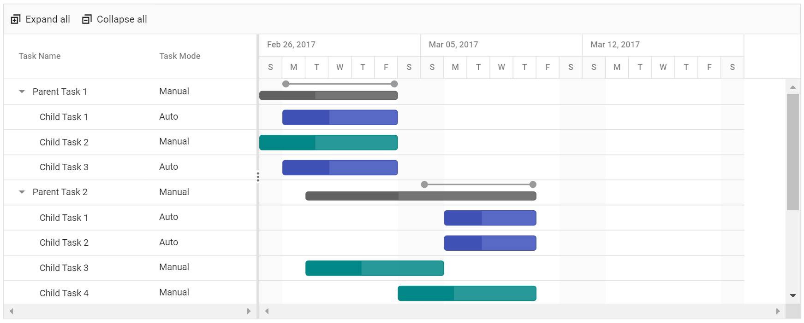
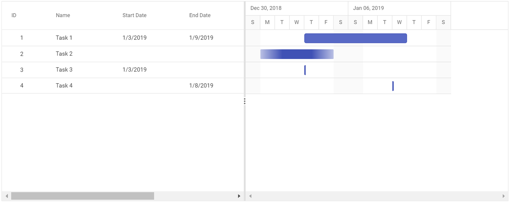

# Task Scheduling

The Gantt provides support for automatic and manual task scheduling modes. It is used to indicate whether the start date and end date of all the tasks will be automatically validated or not. [`taskMode`](https://help.syncfusion.com/cr/aspnetcore-js2/Syncfusion.EJ2.Gantt.Gantt.html#Syncfusion_EJ2_Gantt_Gantt_TaskMode) is the property used to change the schedule mode of a task.

The Gantt control supports three types of mode. They are:

* `Auto`: All the tasks are automatically validate.
* `Manual`: All the tasks are manually validate by the user.
* `Custom`: Both Auto and Manual tasks are render by mapped from data source.

>Note: The default value of [`taskMode`](https://help.syncfusion.com/cr/aspnetcore-js2/Syncfusion.EJ2.Gantt.Gantt.html#Syncfusion_EJ2_Gantt_Gantt_TaskMode) is `Auto`.

## Automatically Scheduled Tasks

When the [`taskMode`](https://help.syncfusion.com/cr/aspnetcore-js2/Syncfusion.EJ2.Gantt.Gantt.html#Syncfusion_EJ2_Gantt_Gantt_TaskMode) property is set as `Auto`, the start date and end date of all the tasks in the project will be automatically validated. That is, dates are validated based on various factors such as working time, holidays, weekends and predecessors.





## Manually Scheduled Tasks

When the [`taskMode`](https://help.syncfusion.com/cr/aspnetcore-js2/Syncfusion.EJ2.Gantt.Gantt.html#Syncfusion_EJ2_Gantt_Gantt_TaskMode) property is set as `Manual`, the start date and end date of all the tasks in the project will be same as given in the data source. That is, dates are not validated based on various factors such as dependencies between tasks, holidays, weekends, working time.
We can restrict this mode in predecessor validation alone. That is, we can automatically validate the dates based on predecessor values by enabling the [`validateManualTasksOnLinking`](https://help.syncfusion.com/cr/aspnetcore-js2/Syncfusion.EJ2.Gantt.Gantt.html#Syncfusion_EJ2_Gantt_Gantt_ValidateManualTasksOnLinking) property.





## Custom

When the [`taskMode`](https://help.syncfusion.com/cr/aspnetcore-js2/Syncfusion.EJ2.Gantt.Gantt.html#Syncfusion_EJ2_Gantt_Gantt_TaskMode) property is set as `Custom`, the scheduling mode for each tasks will be mapped from the data source field. The `Boolean` property [`taskFields.manual`](https://help.syncfusion.com/cr/aspnetcore-js2/Syncfusion.EJ2.Gantt.GanttTaskFieldsBuilder.html#Syncfusion_EJ2_Gantt_GanttTaskFieldsBuilder_Manual_System_String_) is used to map the manual scheduling mode field from the data source.





## Unscheduled Tasks

Unscheduled tasks are planned for a project without any definite schedule dates. The Gantt control supports rendering the unscheduled tasks. You can create or update the tasks with anyone of start date, end date, and duration values or none. You can enable or disable the unscheduled tasks by using the [`allowUnscheduledTasks`](https://help.syncfusion.com/cr/aspnetcore-js2/Syncfusion.EJ2.Gantt.Gantt.html#Syncfusion_EJ2_Gantt_Gantt_AllowUnscheduledTasks) property. The following images represent the various types of unscheduled tasks in Gantt.

Taskbar state |Auto |Manual
-----|-----|-----
`Start Date Only` |  | 
`End Date Only` |  | 
`Duration Only` |  | 
`Milestone`|  | 

>Note: A milestone is a task that has no start and end dates, but it has a duration value of zero

## Define unscheduled tasks in data source

You can define the various types of unscheduled tasks in the data source as follows





> NOTE
> If the [`allowUnscheduledTasks`](https://help.syncfusion.com/cr/aspnetcore-js2/Syncfusion.EJ2.Gantt.Gantt.html#Syncfusion_EJ2_Gantt_Gantt_AllowUnscheduledTasks) property is set to false, then the Gantt control automatically calculates the scheduled date values with a default value of duration 1 and the project start date is considered as the start date for the task.

## Working Time Range

In the Gantt control, working hours in a day for a project can be defined by using the [`dayWorkingTime`](https://help.syncfusion.com/cr/aspnetcore-js2/Syncfusion.EJ2.Gantt.Gantt.html#Syncfusion_EJ2_Gantt_Gantt_DayWorkingTime) property. Based on the working hours, automatic date scheduling and duration validations for a task are performed.

The following code snippet explains how to define the working time range for the project in Gantt.





> NOTE
>* Individual tasks can lie between any time within the defined working time range of the project.
>* The [`dayWorkingTime`](https://help.syncfusion.com/cr/aspnetcore-js2/Syncfusion.EJ2.Gantt.Gantt.html#Syncfusion_EJ2_Gantt_Gantt_DayWorkingTime) property is used to define the working time for the whole project.

## Weekend/Non-working days

Non-working days/weekend are used to represent the non-productive days in a project. You can define the non-working days in a week using the [`workWeek`](https://help.syncfusion.com/cr/aspnetcore-js2/Syncfusion.EJ2.Gantt.Gantt.html#Syncfusion_EJ2_Gantt_Gantt_WorkWeek) property in Gantt.





> By default, Saturdays and Sundays are considered as non-working days/weekend in a project.
> In the Gantt control, you can make weekend as working day by setting the [`includeWeekend`](https://help.syncfusion.com/cr/aspnetcore-js2/Syncfusion.EJ2.Gantt.Gantt.html#Syncfusion_EJ2_Gantt_Gantt_IncludeWeekend) property to `true`.