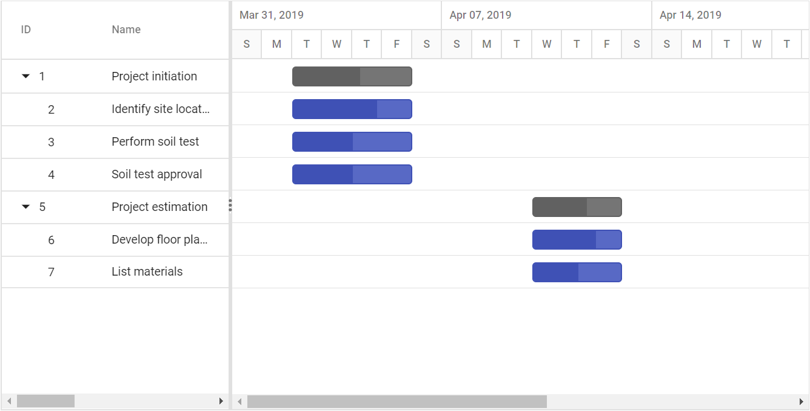
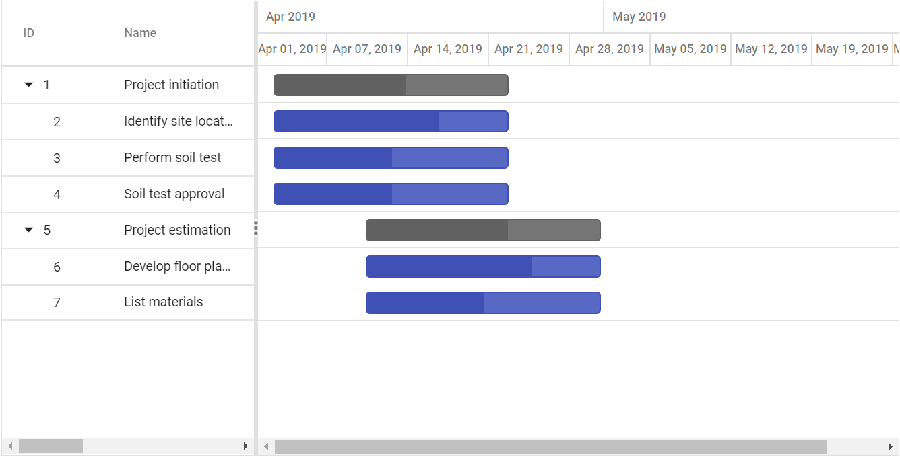
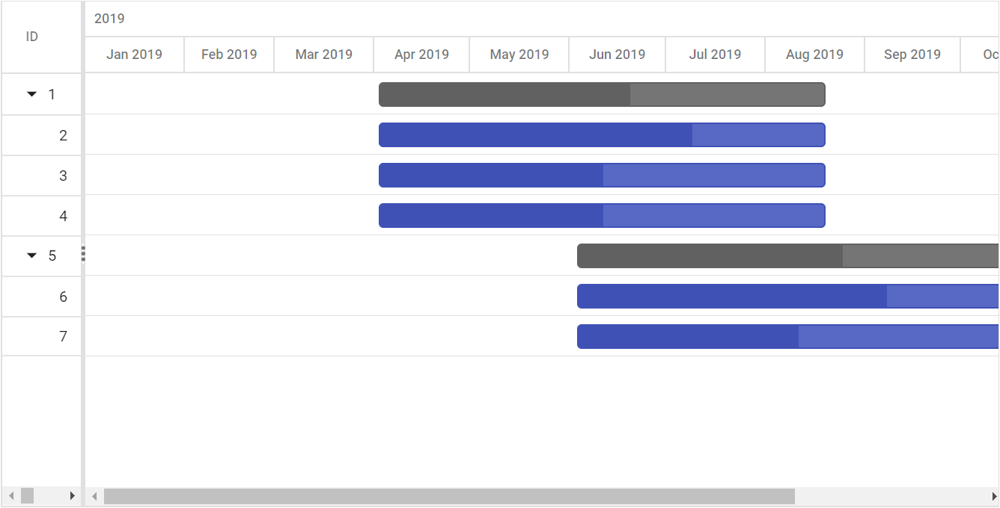
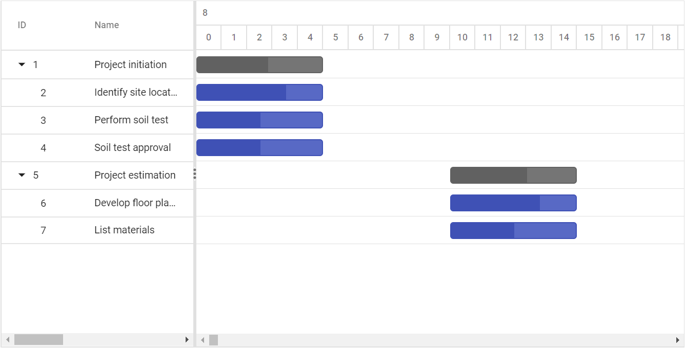
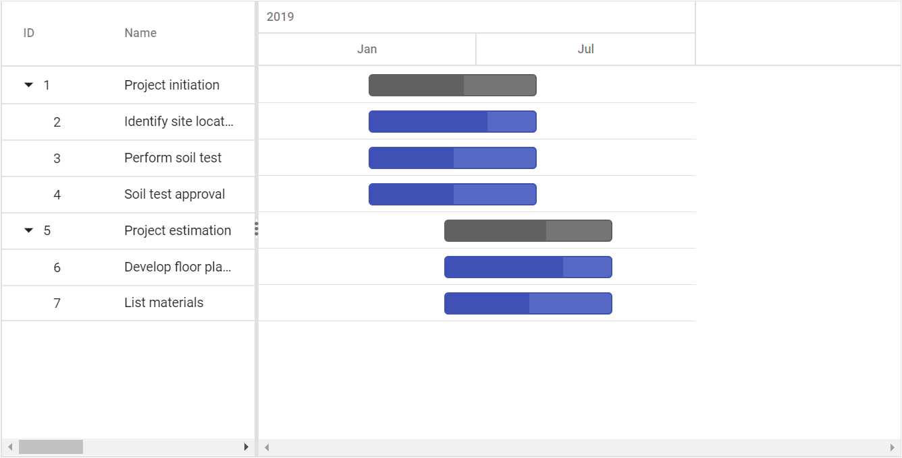
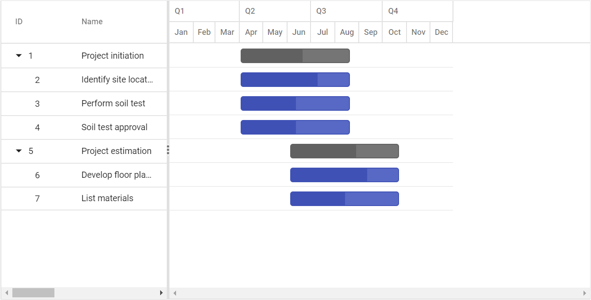
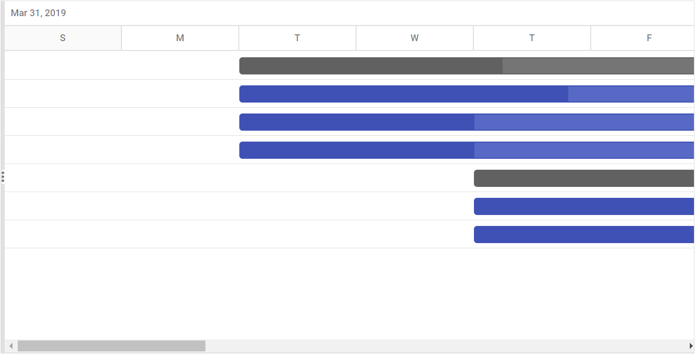
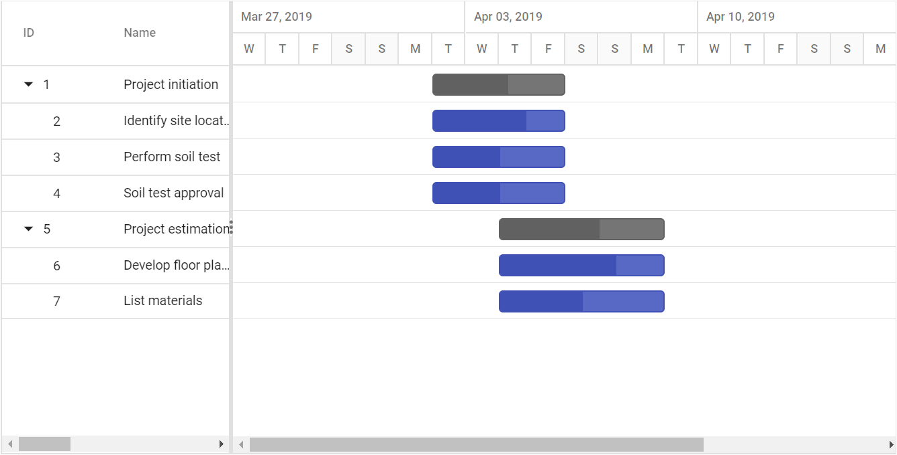

# Timeline

In the Gantt control, timeline is used to represent the project duration as individual cells with defined unit and formats.

## Timeline view modes

Gantt contains the following in-built timeline view modes:

* Hour
* Week
* Month
* Year

Timescale mode in Gantt can be defined by using [`TimelineViewMode`](https://help.syncfusion.com/cr/aspnetcore-js2/Syncfusion.EJ2.Gantt.TimelineViewMode.html) property and also we can define timescale mode of top tier and bottom tier by using [`TopTier.Unit`](https://help.syncfusion.com/cr/aspnetcore-js2/Syncfusion.EJ2.Gantt.GanttTimelineTierSettings.html#Syncfusion_EJ2_Gantt_GanttTimelineTierSettings_Unit) and [`BottomTier.Unit`](https://help.syncfusion.com/cr/aspnetcore-js2/Syncfusion.EJ2.Gantt.GanttTimelineTierSettings.html#Syncfusion_EJ2_Gantt_GanttTimelineTierSettings_Unit) properties.

### Week timeline mode

In the `Week` timeline mode, the upper part of the schedule header displays the weeks, whereas the bottom half of the header displays the days. Refer to the following code example.





### Month timeline mode

In the `Month` timeline mode, the upper part of the schedule header displays the months, whereas the bottom header of the schedule displays its corresponding weeks. Refer to the following code example.





### Year timeline mode

In the `Year` timeline mode, the upper schedule header displays the years whereas, the bottom header displays its corresponding months. Refer to the following code example.





### Day timeline mode

In the `Day` timeline mode, the upper part of the header displays the days whereas, the bottom schedule header displays its corresponding hours. Refer to the following code example.





### Hour timeline mode

An `Hour` timeline mode tracks the tasks in minutes scale. In this mode, the upper schedule header displays hour scale and the lower schedule header displays its corresponding minutes.





## Top tier and Bottom tier

Gantt control contains two tier layout in timeline, we can customize the top tier and bottom tier using [`TopTier`](https://help.syncfusion.com/cr/aspnetcore-js2/Syncfusion.EJ2.Gantt.GanttTimelineSettings.html#Syncfusion_EJ2_Gantt_GanttTimelineSettings_TopTier) and [`BottomTier`](https://help.syncfusion.com/cr/aspnetcore-js2/Syncfusion.EJ2.Gantt.GanttTimelineSettings.html#Syncfusion_EJ2_Gantt_GanttTimelineSettings_BottomTier) properties. Timeline tier's unit can be defined by using [`Unit`](https://help.syncfusion.com/cr/aspnetcore-js2/Syncfusion.EJ2.Gantt.GanttTimelineTierSettings.html#Syncfusion_EJ2_Gantt_GanttTimelineTierSettings_Unit) property and [`Format`](https://help.syncfusion.com/cr/aspnetcore-js2/Syncfusion.EJ2.Gantt.GanttTimelineTierSettings.html#Syncfusion_EJ2_Gantt_GanttTimelineTierSettings_Format) property was used to define date format of timeline cell and [`Count`](https://help.syncfusion.com/cr/aspnetcore-js2/Syncfusion.EJ2.Gantt.GanttTimelineTierSettings.html#Syncfusion_EJ2_Gantt_GanttTimelineTierSettings_Count) property was used to define how many unit will be combined as single cell and [`Formatter`](https://help.syncfusion.com/cr/aspnetcore-js2/Syncfusion.EJ2.Gantt.GanttTimelineTierSettings.html#Syncfusion_EJ2_Gantt_GanttTimelineTierSettings_Formatter) property was used to define custom method to format the date value of timeline cell.





### Combining timeline cells

In Gantt, timeline cells in top tier and bottom tier can be combined with number of timeline units, this can be acheived by using [`TopTier.Count`](https://help.syncfusion.com/cr/aspnetcore-js2/Syncfusion.EJ2.Gantt.GanttTimelineTierSettings.html#Syncfusion_EJ2_Gantt_GanttTimelineTierSettings_Count) and [`BottomTier.Count`](https://help.syncfusion.com/cr/aspnetcore-js2/Syncfusion.EJ2.Gantt.GanttTimelineTierSettings.html#Syncfusion_EJ2_Gantt_GanttTimelineTierSettings_Count) properties. Please refer the below sample.





### Format value of timeline cell

In the Gantt control, you can format the value of top and bottom timeline cells using the standard date format string or the custom formatter method. This can be done using the [`TopTier.Format`](https://help.syncfusion.com/cr/aspnetcore-js2/Syncfusion.EJ2.Gantt.GanttTimelineTierSettings.html#Syncfusion_EJ2_Gantt_GanttTimelineTierSettings_Format), [`TopTier.Formatter`](https://help.syncfusion.com/cr/aspnetcore-js2/Syncfusion.EJ2.Gantt.GanttTimelineTierSettings.html#Syncfusion_EJ2_Gantt_GanttTimelineTierSettings_Formatter), [`BottomTier.Format`](https://help.syncfusion.com/cr/aspnetcore-js2/Syncfusion.EJ2.Gantt.GanttTimelineTierSettings.html#Syncfusion_EJ2_Gantt_GanttTimelineTierSettings_Format) and [`BottomTier.Formatter`](https://help.syncfusion.com/cr/aspnetcore-js2/Syncfusion.EJ2.Gantt.GanttTimelineTierSettings.html#Syncfusion_EJ2_Gantt_GanttTimelineTierSettings_Formatter) properties. The following example shows how to use the formatter method for timeline cells.





## Timeline cell width

In the Gantt control, you can define the width value of timeline cell using the [`TimelineSettings.TimelineUnitSize`](https://help.syncfusion.com/cr/aspnetcore-js2/Syncfusion.EJ2.Gantt.GanttTimelineSettings.html#Syncfusion_EJ2_Gantt_GanttTimelineSettings_TimelineUnitSize) property. This value will be set to the bottom timeline cell, and the width value of top timeline cell will be calculated automatically based on bottom tier cell width using the [`TopTier.Unit`](https://help.syncfusion.com/cr/aspnetcore-js2/Syncfusion.EJ2.Gantt.GanttTimelineTierSettings.html#Syncfusion_EJ2_Gantt_GanttTimelineTierSettings_Unit) and [`TimelineSettings.TimelineUnitSize`](https://help.syncfusion.com/cr/aspnetcore-js2/Syncfusion.EJ2.Gantt.GanttTimelineSettings.html#Syncfusion_EJ2_Gantt_GanttTimelineSettings_TimelineUnitSize) properties. Refer to the following example.





## Week start day customization

In the Gantt control, you can customize the week start day using the [`WeekStartDay`](https://help.syncfusion.com/cr/aspnetcore-js2/Syncfusion.EJ2.Gantt.GanttTimelineSettings.html#Syncfusion_EJ2_Gantt_GanttTimelineSettings_WeekStartDay) property. By default, the [`WeekStartDay`](https://help.syncfusion.com/cr/aspnetcore-js2/Syncfusion.EJ2.Gantt.GanttTimelineSettings.html#Syncfusion_EJ2_Gantt_GanttTimelineSettings_WeekStartDay) is set to 0, which specifies the Sunday as a start day of the week. But, you can customize the week start day by using the following code example.





## Customize automatic timescale update action

In the Gantt control, the schedule timeline will be automatically updated when the tasks date values are updated beyond the project start date and end date ranges. This can be enabled or disabled using the [`UpdateTimescaleView`](https://help.syncfusion.com/cr/aspnetcore-js2/Syncfusion.EJ2.Gantt.GanttTimelineSettings.html#Syncfusion_EJ2_Gantt_GanttTimelineSettings_UpdateTimescaleView) property.





## Zooming

The zooming support provides options to increase or decrease the width of timeline cells and also provides options to change the timeline units dynamically. This support enables you to view the tasks in a project clearly from minute to decade timespan. To enable the zooming features, define the `ZoomIn`, `ZoomOut`, and `ZoomToFit` items to [`Toolbar`](https://help.syncfusion.com/cr/aspnetcore-js2/Syncfusion.EJ2.Gantt.Gantt.html#Syncfusion_EJ2_Gantt_Gantt_Toolbar) items collections, and this action can be performed on external actions such as button click using the `zoomIn`, `zoomOut`, and `fitToProject` built-in methods. The following zooming options are available to view the project:

### Zoom in

This support is used to increase the timeline width and timeline unit from years to minutes
timespan. When the `ZoomIn` icon was clicked, the timeline cell width is increased when the cell
size exceeds the specified range and the timeline unit is changed based on the current zoom levels.

### Zoom out

This support is used to increase the timeline width and timeline unit from minutes to years timespan. When the `ZoomOut` icon was clicked, the timeline cell width is decreased when the cell size falls behind the specified range and the timeline view mode is changed based on the current zooming levels.

### Zoom to fit

This support is used to view all the tasks available in a project within available area on the chart part of Gantt. When users click the `ZoomToFit` icon, then all the tasks are rendered within the available chart container width.





## Customizing zooming levels

In Gantt, the zoom in and zoom out actions are performed based on the predefined zooming levels in the `zoomingLevels` property. You can customize the zooming actions by defining the required zooming collection to the `zoomingLevels` property.





## Zoom action by methods

You can perform the various zoom actions dynamically or on external click action using the following methods:
* Zoom in - `zoomIn`
* Zoom out - `zoomOut`
* Fit to project - `fitToProject`



