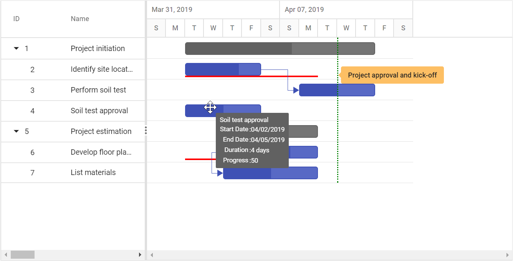
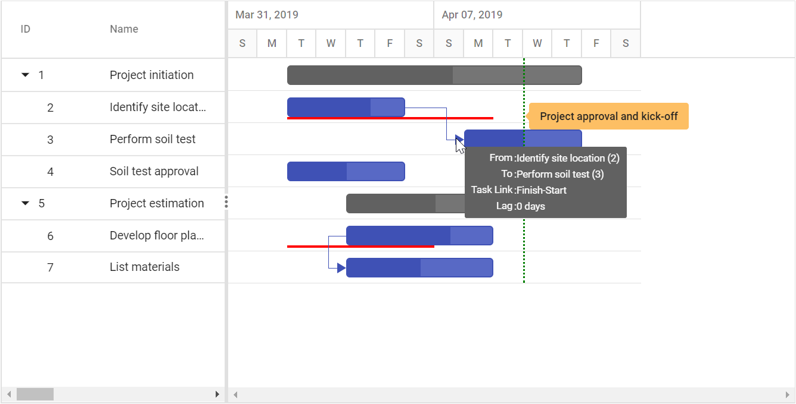
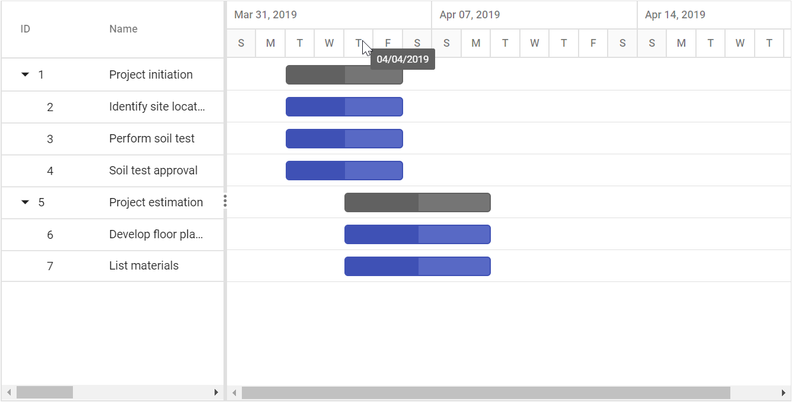
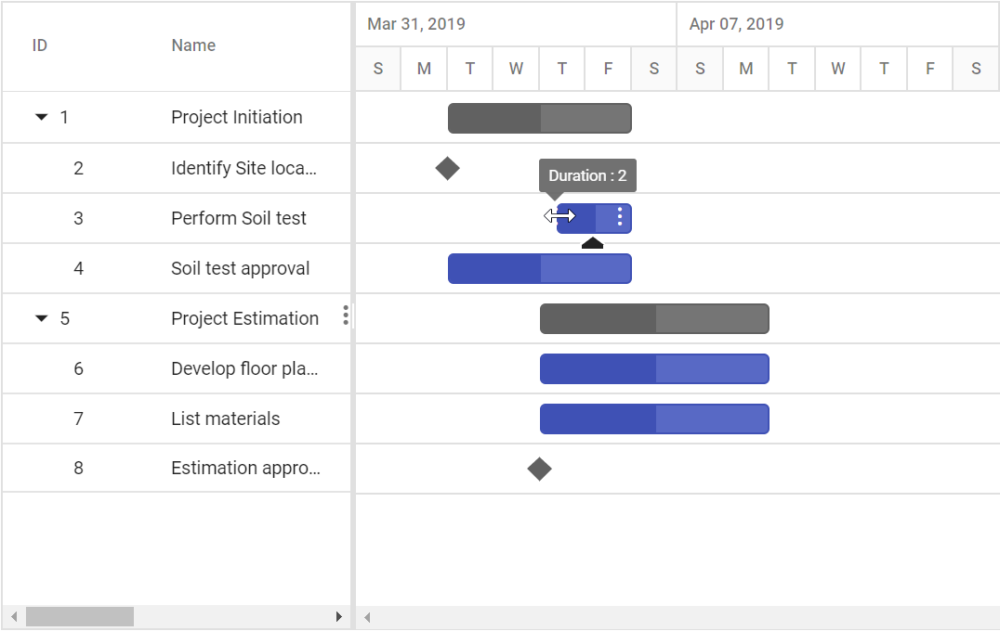

# Tooltip

The Gantt control has a support to display a tooltip for various UI elements like taskbar, timeline cells, and grid cells

## Enable tooltip

In the Gantt control, you can enable or disable the mouse hover tooltip for the following UI elements using the [`TooltipSettings.ShowTooltip`](https://help.syncfusion.com/cr/aspnetcore-js2/Syncfusion.EJ2.Gantt.GanttTooltipSettings.html#Syncfusion_EJ2_Gantt_GanttTooltipSettings_ShowTooltip) property:

* Taskbar
* Connector line
* Baseline
* Event marker





Taskbar Tooltip

Dependency Tooltip

Baseline Tooltip

Event Marker Tooltip

> The default value of the [`TooltipSettings.ShowTooltip`](https://help.syncfusion.com/cr/aspnetcore-js2/Syncfusion.EJ2.Gantt.GanttTooltipSettings.html#Syncfusion_EJ2_Gantt_GanttTooltipSettings_ShowTooltip) property is true.

## Timeline cells tooltip

In the Gantt control, you can enable or disable the mouse hover tooltip of timeline cells using the [`TimelineSettings.ShowTooltip`](https://help.syncfusion.com/cr/aspnetcore-js2/Syncfusion.EJ2.Gantt.GanttTimelineSettings.html#Syncfusion_EJ2_Gantt_GanttTimelineSettings_ShowTooltip) property. The default value of this property is true. The following code example shows how to enable the timeline cells tooltip in Gantt.





## Cell tooltip

You can enable or disable the Grid cell tooltip using the [`Columns.ClipMode`](https://help.syncfusion.com/cr/aspnetcore-js2/Syncfusion.EJ2.Gantt.GanttColumn.html#Syncfusion_EJ2_Gantt_GanttColumn_ClipMode) property.





### Clip mode

The clip mode provides options to display its overflow cell content and it can be defined by the [`Columns.ClipMode`](https://help.syncfusion.com/cr/aspnetcore-js2/Syncfusion.EJ2.Gantt.GanttColumn.html#Syncfusion_EJ2_Gantt_GanttColumn_ClipMode) property.

The following are three types of `ClipMode`:

* `Clip`: Truncates the cell content when it overflows its area.
* `Ellipsis`: Displays ellipsis when content of the cell overflows its area.
* `EllipsisWithTooltip`: Displays ellipsis when content of the cell overflows its area; it displays the tooltip content when hover over ellipsis.

> NOTE
> By default, all the column's [`ClipMode`](https://help.syncfusion.com/cr/aspnetcore-js2/Syncfusion.EJ2.Gantt.GanttColumn.html#Syncfusion_EJ2_Gantt_GanttColumn_ClipMode) property is defined as `EllipsisWithTooltip`.

## Tooltip template

### Taskbar tooltip

The default tooltip in the Gantt control can be customized using the [`TooltipSettings.Taskbar`](https://help.syncfusion.com/cr/aspnetcore-js2/Syncfusion.EJ2.Gantt.GanttTooltipSettings.html#Syncfusion_EJ2_Gantt_GanttTooltipSettings_Taskbar) property. You can map the template script element’s ID value or template string directly to this property.





The below screenshot shows the output of above code example.

### Connector line tooltip

The default connector line tooltip in the Gantt control can be customized using the [`TooltipSettings.ConnectorLine`](https://help.syncfusion.com/cr/aspnetcore-js2/Syncfusion.EJ2.Gantt.GanttTooltipSettings.html#Syncfusion_EJ2_Gantt_GanttTooltipSettings_ConnectorLine) property. You can map the value to this property as template script element ID or template string format. The following code example shows how to use the [`TooltipSettings.ConnectorLine`](https://help.syncfusion.com/cr/aspnetcore-js2/Syncfusion.EJ2.Gantt.GanttTooltipSettings.html#Syncfusion_EJ2_Gantt_GanttTooltipSettings_ConnectorLine) property.





The below screenshot shows the output of above code example.

### Taskbar editing tooltip

The taskbar editing tooltip can be customized using the [`TooltipSettings.Editing`](https://help.syncfusion.com/cr/aspnetcore-js2/Syncfusion.EJ2.Gantt.GanttTooltipSettings.html#Syncfusion_EJ2_Gantt_GanttTooltipSettings_Editing) property. The following code example shows how to customize the taskbar editing tooltip in Gantt.





The below screenshot shows the output of above code example.

### Baseline tooltip

A baseline tooltip can be customized using the [`TooltipSettings.Baseline`](https://help.syncfusion.com/cr/aspnetcore-js2/Syncfusion.EJ2.Gantt.GanttTooltipSettings.html#Syncfusion_EJ2_Gantt_GanttTooltipSettings_Baseline) property. The following code example shows how to customize the baseline tooltip in Gantt.





The following screenshot shows the template for baseline in Gantt.

