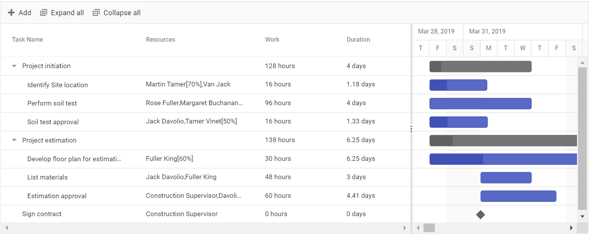
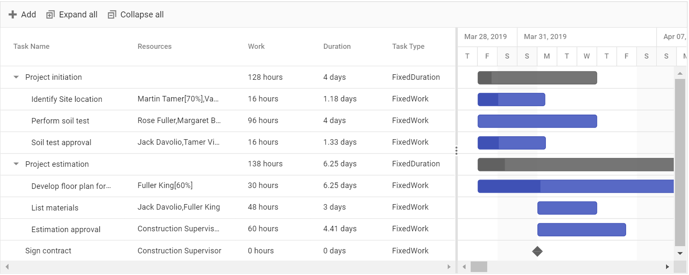

# Work

The work is the total hours required to complete a task. Work can be mapped from the data source field using the property [`taskFields.work`](https://help.syncfusion.com/cr/aspnetcore-js2/Syncfusion.EJ2.Gantt.GanttTaskFieldsBuilder.html#Syncfusion_EJ2_Gantt_GanttTaskFieldsBuilder_Work_System_String_). Work can be measured in
`Hour`, `Day`, `Minute`. By default, work is measured in `Hour` and it can be changed, by using the property [`workUnit`](https://help.syncfusion.com/cr/aspnetcore-js2/Syncfusion.EJ2.Gantt.WorkUnit.html).

>Note: When the work field is mapped from the data source, the default task type will be `FixedWork`.





## Task type

The work, duration and resource unit fields of a task depends upon each other and will change automatically on editing any one of these fields. But we can also set these field’s values as constant using the [`taskType`](https://help.syncfusion.com/cr/aspnetcore-js2/Syncfusion.EJ2.Gantt.TaskType.html) property. `FixedUnit` is the default [`taskType`](https://help.syncfusion.com/cr/aspnetcore-js2/Syncfusion.EJ2.Gantt.TaskType.html). The following values can be set to the [`taskType`](https://help.syncfusion.com/cr/aspnetcore-js2/Syncfusion.EJ2.Gantt.TaskType.html)
 property,

* `FixedDuration` - Duration task field will remain constant while updating resource unit or work field.
* `FixedWork` - Work field will remain constant while updating resource unit or duration fields.
* `FixedUnit` - Resource units will remain constant while updating duration or work field.





Following table explains how the work, duration and resource unit fields will gets updated on changing any of the fields

Task Type | Changes in Duration | Changes in work | Changes in Resource Units
-----|-----|-----|-----
Fixed Duration | Work field updates | Resource unit updates| Work field updates
Fixed Work | Resource unit updates. Note: For manually scheduled task work will update.| Duration field updates. Note: For manually scheduled task resource unit updates. |Duration will update. Note: For manually scheduled task work field updates.
Fixed Unit | Work field updates | Duration field updates. Note: For manually scheduled task resource unit updates.| Duration will update. Note: For manually scheduled task work field updates.

>Note: 1. Fixed Unit is the default taskType in Gantt. 2. The above calculations are not applicable for Milestones.