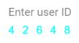

# Customize the UI appearance of the control

The appearance of the MaskedTextBox can be changed by adding custom `cssClass` to the control and enabling styles.
Refer to the following example to change the appearance of the MaskedTextBox.





Output be like the below.

