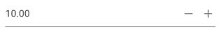

# Customize the spin button’s up and down arrow

This section explains about how to change/customize spin up and down icons. You can customize spin button icons using `e-spin-up` and `e-spin-down`
classes of those buttons.

You can override the default icons of `e-spin-up` and `e-spin-down` classes using the following CSS code snippets.

```css
  .e-numeric .e-input-group-icon.e-spin-up:before {
    content: "\e823";
    color: rgba(0, 0, 0, 0.54);
  }
  .e-numeric .e-input-group-icon.e-spin-down:before {
    content: "\e934";
    color: rgba(0, 0, 0, 0.54);
  }
```





Output be like the below.

