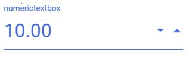

# Customize the UI appearance of the control

You can change the appearance of the NumericTextBox by adding custom `cssClass` to the control and enabling styles. Refer to the following example to change the appearance of the NumericTextBox.





Output be like the below.

