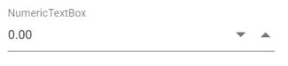

# Prevent nullable input in NumericTextBox

By default, the value of the NumericTextBox sets to null. In some applications, the value of the NumericTextBox should not be null at any instance. In such cases, following sample can be used to prevent nullable input in NumericTextBox.





Output be like the below.

