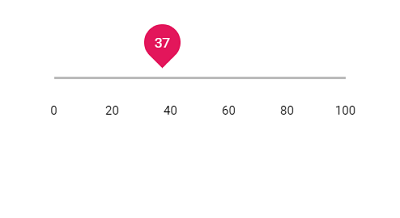
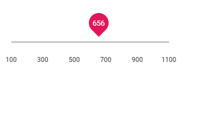

# Ticks

The Ticks in Slider supports you to easily identify the current value/values of the Slider. It contains `smallStep` and `largeStep`. The value of the major ticks alone will be displayed in the slider. In order to enable/disable the small ticks, use the `showSmallTicks` property.





## Step

When the Slider is moved, it increases/decreases the value based on the step value. By default, the value is increased/decreased by 1. Use the `step` property to change the increment step value.





## Min and Max

Enables the minimum/starting and maximum/ending value of the Slider, by using the `min` and `max` property. By default, the minimum value is 1 and maximum value is 100. In the following sample the slider is rendered with the min value as 100 and max value as 1000.





