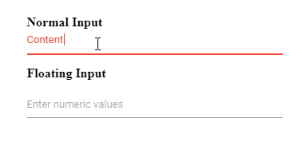

# Change the color of the TextBox based on its value

You can change the color of the TextBox by validating its value using regular expression in the `keyup` event for predicting the numeric values as demonstrated in the following code sample.





Output be like the below.

