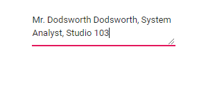
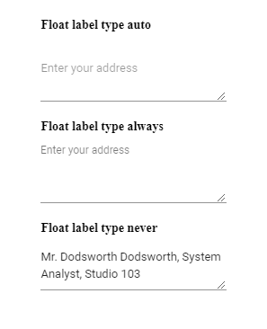
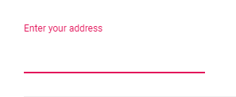

# Multiline TextBox

This feature allows the textbox to accept one or more lines of text like address, description, comments, and more.

## Create multiline textbox

You can convert the default textbox into the multiline textbox by setting the [multiline](https://help.syncfusion.com/cr/aspnetcore-js2/Syncfusion.EJ2.Inputs.TextBox.html#Syncfusion_EJ2_Inputs_TextBox_Multiline) API value as true or pass HTML5 textarea as element to the textbox.

> The multiline textbox allows you to resize it in vertical direction alone.





Output be like the below.



## Implementing floating label

You can achieve the floating label behavior in the multiline textbox by setting [floatLabelType](https://help.syncfusion.com/cr/aspnetcore-js2/Syncfusion.EJ2.Inputs.TextBox.html#Syncfusion_EJ2_Inputs_TextBox_FloatLabelType) as 'Auto'. The placeholder text act as floating label to the multiline textbox. You can provide the placeholder text to the multiline textbox either by using the [placeholder](https://help.syncfusion.com/cr/aspnetcore-js2/Syncfusion.EJ2.Inputs.TextBox.html#Syncfusion_EJ2_Inputs_TextBox_Placeholder) property or placeholder attribute.





Output be like the below.



## Auto resizing

By default, you can manually resize the multiline textbox. But you can also create an `auto resizing` multiline textbox with both the initial and dynamic value change. It can be done by calculating the height of the textarea in the created event for initial value update and in the input event for dynamic value update of the auto resize multiline textbox, as explained in the following code sample.





## Disable resizing

By default, the multiline textbox is rendered with resizable. You can disable the resize of the multiline textbox by applying the following CSS styles.

```CSS
    textarea.e-input,
    .e-float-input textarea,
    .e-float-input.e-control-wrapper textarea,
    .e-input-group textarea,
    .e-input-group.e-control-wrapper textarea {
        resize: none;
    }

```





Output be like the below.



## Limit the text length

By default, the text length of the multiline textbox is unlimited. You can limit the text length by setting the `maxLength` attribute using the `addAttributes` method.





## Count characters

You can show the number of characters entered inside the textarea by calculating the character count in the input event of multiline textbox. The character count is updated while entering or deleting any character inside the textarea. The character count shows how many characters can be entered or left to be entered.





Output be like the below.

