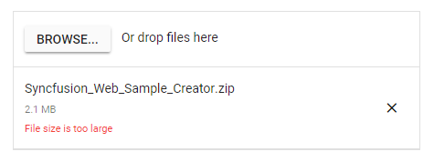

# Validation

The uploader control validate the selected files size and extension using the [allowedExtensions](https://help.syncfusion.com/cr/aspnetcore-js2/Syncfusion.EJ2.Inputs.Uploader.html#Syncfusion_EJ2_Inputs_Uploader_AllowedExtensions), [minFileSize](https://help.syncfusion.com/cr/aspnetcore-js2/Syncfusion.EJ2.Inputs.Uploader.html#Syncfusion_EJ2_Inputs_Uploader_MinFileSize) and [maxFileSize](https://help.syncfusion.com/cr/aspnetcore-js2/Syncfusion.EJ2.Inputs.Uploader.html#Syncfusion_EJ2_Inputs_Uploader_MaxFileSize) properties. The files can be validated before uploading to the server and can be ignored on uploading.
Also, you can validate the files by setting the HTML attributes to the original input element.
The validation process occurs on drag-and-drop the files also.

## File type

You can allow the specific files alone to Upload using the [allowedExtensions](https://help.syncfusion.com/cr/aspnetcore-js2/Syncfusion.EJ2.Inputs.Uploader.html#Syncfusion_EJ2_Inputs_Uploader_AllowedExtensions) property. The extension can be represented as collection by comma separators. The uploader control filters the selected or dropped files to match against the specified file types and processes the upload operation. The validation happens when you specify value to inline attribute to accept the original input element.





Output be like the below.

## File size

The uploader control allows you to validate the files based on its size. The validation helps to restrict uploading large files or empty files to the server. The size can be represented in `bytes`. By default, the uploader control allows you to upload **minimum file size** as 0 byte and **maximum file size** as 28.4 MB using the [minFileSize](https://help.syncfusion.com/cr/aspnetcore-js2/Syncfusion.EJ2.Inputs.Uploader.html#Syncfusion_EJ2_Inputs_Uploader_MinFileSize) and [maxFileSize](https://help.syncfusion.com/cr/aspnetcore-js2/Syncfusion.EJ2.Inputs.Uploader.html#Syncfusion_EJ2_Inputs_Uploader_MaxFileSize) properties.





Output be like the below.

## Maximum files count

You can restrict uploading the maximum number of files using the **selected** event. In the selected event arguments, you can get the currently selected files details using the `getFilesData()`. You can modify the files details and assign the modified file list to the `eventArgs.modifiedFilesData`.





## Duplicate files

You can validate the duplicate files before uploading to server using the selected event.
Compare the selected files with the existing files data and filter the file list by removing the duplicate files.





## See Also

* [Validate image/* on drop](./how-to/validate-image-on-drop)
* [Determine whether uploader has file input (required validation)](./how-to/determine-whether-the-uploader-has-input-file)
* [Check file size before uploading it](./how-to/check-file-size-before-uploading-it)
* [Check the MIME type of file before uploading it](./how-to/check-the-mime-type-of-file-before-upload-it)
