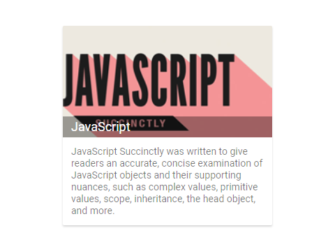
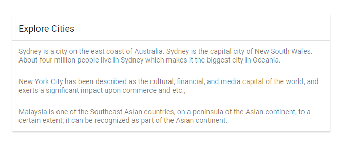

# Images and Divider

## Images

The Card supports to include images within the elements, you can add image as direct element anywhere inside card root by adding the `e-card-image` class to `div` element. Using the class defined, you can write CSS styles to load images to that element.

> By default, card images occupies full width of its parent element.

```html
    <div class = "e-card">
        <div class="e-card-image">
        </div>
    </div>
```

### Title

Card image is supported to include a title or caption for the image. By default, Title is placed over the image on left-bottom position with overlay.

```html
    <div class = "e-card">
        <div class="e-card-image">
            <div class="e-card-title"></div>
        </div>
    </div>
```





Output be like the below.



## Divider

Divider used to separate the elements inside the card. You can add divider inside the card elements to separate it.

* Place the `div` element with `e-card-separator` class inside the card element for adding a divider.





Output be like the below.



## See Also

* [How to customize the card image title position](./how-to/customize-the-card-image-title-position)