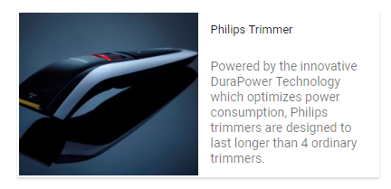

# Horizontal Card

By default, all the card elements are aligned vertically one after the other as in the DOM. You can achieve the element to align horizontally as well by adding the class `e-card-horizontal` in the root card element.

## Stacked cards

* An horizontally aligned card can push a specific column to align vertical using `e-card-stacked` class. This will align the stacked section vertically aligned differentiating from horizontal layout.

Class   | Description
------------ | -------------
`e-card-horizontal` | To align card elements horizontally.
`e-card-stacked` | To align elements vertically within the horizontal layout.

```html
        <div tabindex="0" class="e-card e-card-horizontal">
               --> Aligned in horizontal
            <div class="e-card-stacked">         --> Aligned in horizontal
               // Inside the element all are aligned vertical directions
            </div>
        </div>
```





Output be like the below.

